- [РЖЯ ML - SL2T](#РЖЯ-ML---SL2T)
- [1 MVP Приложение РЖЯ](#1-MVP-Приложение-РЖЯ)
- [2 MVP Полное ТЗ](#2-MVP-Полное-ТЗ)
- [3 MVP ER-модель](#3-MVP-ER---модель)
- [4 MVP физическая модель БД](#4-MVP-физическая-модель-БД)

# РЖЯ ML - SL2T

**Технически такой подход вполне можно использовать для русского жестового языка (РЖЯ)**. Но есть важное ограничение: **конкретную модель SL2T из статьи Google DeepMind сейчас нельзя просто скачать и встроить в мобильное приложение как готовую RSL→Russian модель**. В опубликованном продукте SL2T используется для **ASL → English**, а сама модель работает как сервис/закрытая часть Gboard и Live Transcribe. ([Google DeepMind](https://deepmind.google/blog/putting-sign-language-ai-into-users-hands/?utm_source=chatgpt.com "Putting sign language AI into users’ hands — Google DeepMind"))

При этом архитектура SL2T очень хорошо подходит как **референс для разработки собственного RSL2T**.

## 1. Что именно предлагает Google

Упрощённо архитектура выглядит так:

```text
Камера смартфона
      │
      ▼
MediaPipe Holistic
      │
      │  landmarks:
      │  руки + тело + лицо
      ▼
последовательность координат
      │
      ▼
SL2T
      │
      │  Sign Language → Text
      ▼
текст
```

Ключевой момент — Google **не передаёт в модель непосредственно видео**. MediaPipe извлекает координаты ключевых точек тела, рук и лица, после чего модель работает с последовательностью этих координат. Google прямо указывает, что это также позволяет сразу отбрасывать исходное видео и повышать приватность. ([Google DeepMind](https://deepmind.google/blog/putting-sign-language-ai-into-users-hands/?utm_source=chatgpt.com "Putting sign language AI into users’ hands — Google DeepMind"))

И это очень интересная архитектура именно для мобильного приложения.

---

# 2. Можно ли сделать то же самое для РЖЯ?

**Да.**

Но я бы разделил задачу на три уровня.

|Уровень|Что получится|Сложность|
|---|---|--:|
|Распознавание отдельных жестов|`ПРИВЕТ → привет`|⭐⭐|
|Распознавание последовательности жестов|`Я → ХОТЕТЬ → КОФЕ`|⭐⭐⭐⭐|
|Полноценный РЖЯ → русский текст|`Я хочу выпить кофе`|⭐⭐⭐⭐⭐|

И именно третий вариант является аналогом Google SL2T.

Причём важно понимать:

> **РЖЯ → русский текст — это не просто классификация жестов.**

Это задача машинного перевода.

Например:

```text
РЖЯ:
Я КОФЕ ХОТЕТЬ

             ↓

Русский:
Я хочу кофе.
```

Поэтому архитектура вида:

```text
Video → распознать каждый жест → склеить слова
```

будет иметь довольно низкое качество на реальном языке.

Google именно поэтому отказался от обязательного промежуточного слоя glosses и переводит последовательность landmarks непосредственно в текст. ([Google DeepMind](https://deepmind.google/blog/putting-sign-language-ai-into-users-hands/?utm_source=chatgpt.com "Putting sign language AI into users’ hands — Google DeepMind"))

---

# 3. Самое интересное — SL2T обучалась более чем на 50 жестовых языках

Это особенно важно для вашего проекта.

Google сообщает, что SL2T обучалась более чем на **100 000 часов данных**, охватывающих более 50 жестовых языков. При этом примерно четверть данных приходится на ASL. Идея заключается в том, что совместное обучение позволяет модели получить общие представления о структуре жестовых языков. ([Google DeepMind](https://deepmind.google/blog/putting-sign-language-ai-into-users-hands/?utm_source=chatgpt.com "Putting sign language AI into users’ hands — Google DeepMind"))

Отсюда возникает очень интересная гипотеза:

```text
                 multilingual SL model
                         │
        ┌────────────────┼────────────────┐
        │                │                │
       ASL              RSL              BSL
        │                │                │
        ▼                ▼                ▼
      English         Russian           English
```

То есть для собственного проекта я бы **не стал обучать RSL-модель с нуля**, если есть возможность получить хорошую предварительно обученную sign-language encoder/model.

---

# 4. Но есть проблема с самим SL2T

Вот здесь надо быть осторожным.

В статье Google говорит:

> SL2T используется в Gboard и Live Transcribe, начиная с ASL → English.

А не:

> «Вот веса SL2T, скачайте их и обучайте на РЖЯ».

На сегодняшний день публично доступной полноценной SL2T-модели Google для самостоятельного deployment я не вижу. Более того, параллельно Google ранее анонсировал SignGemma как open model для sign-language understanding, но публичная доступность этой модели долго оставалась нерешённой; в актуальном сообщении Google 2026 года речь уже идёт о закрытой SL2T в Pixel/Gboard. ([Google DeepMind](https://deepmind.google/blog/putting-sign-language-ai-into-users-hands/?utm_source=chatgpt.com "Putting sign language AI into users’ hands — Google DeepMind"))

Поэтому **нельзя сейчас проектировать приложение с предположением, что вы просто подключите `SL2T.onnx` или `SL2T.tflite`**.

---

# 5. Что я бы сделал для вашего приложения

Если задача — приложение **для изучения РЖЯ**, я бы даже не пытался сразу копировать Google 1:1.

Я бы сделал архитектуру из двух режимов.

### Режим №1 — обучение

```text
                CAMERA
                   │
                   ▼
          MediaPipe Holistic
                   │
                   ▼
          landmarks sequence
                   │
                   ▼
       RSL Sign Recognition
                   │
                   ▼
        ┌──────────────────┐
        │ Правильно: 92%   │
        │                  │
        │ ПРИВЕТ           │
        └──────────────────┘
```

Например, пользователь изучает:

```text
ПРИВЕТ
```

Он показывает жест.

Приложение определяет:

```text
ПРИВЕТ
confidence = 0.94
```

и показывает:

> ✅ Правильно

А дальше можно оценивать качество выполнения:

```text
траектория руки       92%
положение кисти       87%
ориентация ладони     96%
скорость              91%

Итог                   92%
```

Это значительно проще реализовать.

---

# 6. А второй уровень — полноценный SL2T

После этого:

```text
Камера
   │
   ▼
MediaPipe
   │
   ▼
landmarks
   │
   ▼
RSL encoder
   │
   ▼
Temporal Transformer
   │
   ▼
Text decoder
   │
   ▼
"Я хочу изучать русский жестовый язык"
```

Здесь уже появляется настоящая задача translation.

---

# 7. Какие данные существуют для РЖЯ

Это, на мой взгляд, один из самых важных моментов проекта.

Для RSL уже существуют датасеты.

Например, **Slovo** содержит около **20 000 FullHD-видеозаписей**, 1 000 классов жестов и 194 участников. Датасет предназначен преимущественно для isolated sign recognition, то есть распознавания отдельных жестов. ([arXiv](https://arxiv.org/abs/2305.14527?utm_source=chatgpt.com "Slovo: Russian Sign Language Dataset"))

Это хорошо для первого этапа.

Но:

```text
Slovo

ПРИВЕТ.mp4
ДОМ.mp4
ЧЕЛОВЕК.mp4
МАМА.mp4
...
```

ещё не является полноценным корпусом:

```text
Я хочу пойти домой,
потому что сегодня холодно.
```

Для полноценного SL2T вам нужны **видеопоследовательности + соответствующий русский текст**.

---

# 8. Поэтому для вашего проекта я бы создал собственный RSL corpus

Например:

```text
video_000001.mp4
    ↓
"Сегодня я хочу пойти домой"

video_000002.mp4
    ↓
"Где находится метро?"

video_000003.mp4
    ↓
"Я изучаю русский жестовый язык"
```

И обязательно:

```text
signer_id
age_group
gender
left/right handed
region
camera
lighting
background
sentence
```

Причём `signer_id` чрезвычайно важен.

Нельзя сделать:

```text
train = 80%
test = 20%
```

случайным образом по видео.

Нужно:

```text
Signer A ─┐
Signer B ─┤ TRAIN
Signer C ─┤
Signer D ─┘

Signer E ─ TEST
```

Иначе модель фактически запомнит конкретных людей.

---

# 9. Очень интересный вариант: landmarks вместо видео

Я бы рекомендовал именно такой pipeline:

```text
                  смартфон
                     │
                     ▼
              Camera frames
                     │
                     ▼
              MediaPipe
          ┌──────────┼──────────┐
          ▼          ▼          ▼
        Hands       Face       Pose
          │          │          │
          └──────────┼──────────┘
                     ▼
              Feature vector
                     │
                     ▼
              RSL Transformer
                     │
                     ▼
             Russian decoder
                     │
                     ▼
                 TEXT
```

Это очень близко к подходу Google.

MediaPipe выдаёт множество landmark-координат:

```text
left_hand
right_hand
pose
face
```

и вместо:

```text
1920 × 1080 × 30 FPS
```

модель получает условно:

```text
T × N × D
```

где:

- `T` — количество кадров;
    
- `N` — количество landmarks;
    
- `D` — координаты/признаки.
    

Это **намного удобнее для мобильной системы**, чем гонять огромный video transformer.

---

# 10. Но есть одна важная ловушка

Нельзя ограничиваться только руками.

Для РЖЯ очень важны:

```text
руки
+
положение тела
+
голова
+
направление взгляда
+
мимика
+
движение бровей
+
движение губ
```

Google как раз подчёркивает, что жестовые языки используют **руки, руки/предплечья, корпус, голову и лицо одновременно**. ([Google DeepMind](https://deepmind.google/blog/putting-sign-language-ai-into-users-hands/?utm_source=chatgpt.com "Putting sign language AI into users’ hands — Google DeepMind"))

Поэтому архитектура:

```text
MediaPipe Hands → LSTM
```

для серьёзного продукта будет недостаточной.

Я бы делал:

```text
Hands
   +
Pose
   +
Face
   ↓
Multimodal temporal encoder
```

---

# 11. Модель

Для MVP я бы начал даже не с огромного Transformer.

Например:

```text
Landmarks
     ↓
Linear projection
     ↓
Temporal Transformer
     ↓
Transformer decoder
     ↓
Russian text
```

Или:

```text
Landmarks
     ↓
ST-GCN / temporal encoder
     ↓
Transformer
     ↓
Text decoder
```

А затем сравнил бы:

```text
BiLSTM
TCN
Transformer
Conformer
```

---

# 12. А вот здесь появляется очень интересная возможность

Можно использовать **transfer learning**.

Например:

```text
большой multilingual sign model
              │
              ▼
      pretrained encoder
              │
       ┌──────┴──────┐
       │             │
      ASL           RSL
                    │
                    ▼
               fine-tuning
```

Именно идея cross-language transfer сейчас является активным направлением исследований. Например, работа Logos показывает, что предварительно обученный encoder на большом RSL dataset может переноситься на другие задачи распознавания жестовых языков и использоваться для few-shot learning. ([ACL Anthology](https://aclanthology.org/2025.emnlp-main.1238/?utm_source=chatgpt.com "Logos as a Well-Tempered Pre-train for Sign Language Recognition - ACL Anthology"))

---

# 13. Как я вижу production-архитектуру мобильного приложения

Для вашего приложения я бы предложил:

```text
┌──────────────────────────────────────┐
│           MOBILE APP                 │
│                                      │
│  Camera                              │
│    │                                 │
│    ▼                                 │
│  MediaPipe Holistic                  │
│    │                                 │
│    ▼                                 │
│  Landmark normalization              │
│    │                                 │
│    ▼                                 │
│  Local buffer (2–5 sec)              │
│    │                                 │
└────┼─────────────────────────────────┘
     │
     ▼
┌──────────────────────────────────────┐
│           ML MODEL                   │
│                                      │
│ Landmark Encoder                     │
│          ↓                           │
│ Temporal Transformer                 │
│          ↓                           │
│ RSL representation                   │
│          ↓                           │
│ Translation Decoder                  │
│          ↓                           │
│ Russian text                         │
└──────────────────────────────────────┘
```

Причём **MediaPipe и feature extraction я бы обязательно выполнял на устройстве**.

А inference можно первоначально делать:

```text
Mobile → HTTPS → ML server → text
```

а затем постепенно переносить модель на device.

---

# 14. Почему не надо сразу делать всё on-device

Потому что на первом этапе вам важнее:

**качество модели > latency > размер модели.**

Я бы сделал:

### MVP

```text
Camera
  ↓
MediaPipe ON DEVICE
  ↓
Landmarks
  ↓
HTTPS
  ↓
GPU inference server
  ↓
Text
```

После накопления данных:

```text
Camera
  ↓
MediaPipe
  ↓
Quantized RSL model
  ↓
Text
```

То есть:

**server → edge → fully offline**

---

# 15. А если приложение именно для обучения РЖЯ — есть ещё более сильная идея

Не просто:

> «Распознай, что человек показал».

А:

> **«Оцени, насколько правильно человек показал жест».**

Это совершенно другая и очень полезная ML-задача.

Например эталон:

```text
ПРИВЕТ
   │
   ├── траектория руки
   ├── скорость
   ├── положение локтя
   ├── orientation ладони
   ├── положение пальцев
   └── timing
```

Пользователь:

```text
ПРИВЕТ
   │
   ├── траектория       91%
   ├── orientation      74%  ← проблема
   ├── fingers          95%
   └── timing           88%
```

Приложение говорит:

> **Попробуйте ещё раз. Ладонь должна быть повернута немного больше к собеседнику.**

Это может оказаться даже более ценным продуктом, чем просто SL2T.

---

# 16. Моя оценка реализуемости

Если поставить цель:

### MVP за 3–4 месяца

```text
Камера
  ↓
MediaPipe
  ↓
100–1000 жестов
  ↓
RSL classifier
  ↓
подсказка пользователю
```

**Реально.**

### 6–12 месяцев

```text
непрерывная последовательность
        ↓
RSL → Russian
```

**Реально**, но потребуется хороший корпус данных.

### Уровень Google SL2T

```text
50+ языков
100 000+ часов
streaming translation
низкая latency
left/right hand
one-handed signing
hallucination control
```

Это уже **не обычный стартап-MVP**, а большая ML research/engineering задача. Google подчёркивает масштаб именно этого обучения — более 100 тыс. часов и более 50 жестовых языков. ([Google DeepMind](https://deepmind.google/blog/putting-sign-language-ai-into-users-hands/?utm_source=chatgpt.com "Putting sign language AI into users’ hands — Google DeepMind"))

---

## 17. Итого

Я бы сформулировал ответ так:

> **Интегрировать непосредственно Google SL2T в приложение для РЖЯ сейчас, судя по доступной информации, нельзя: опубликованный SL2T — закрытая технология, используемая Google для ASL→English. Но архитектуру SL2T вполне возможно воспроизвести для РЖЯ: MediaPipe Holistic → последовательность landmarks → multilingual/pretrained sign encoder → RSL fine-tuning → Transformer text decoder.**

Причём для вашего приложения я бы **не начинал с полноценного SL2T**.

Я бы строил продукт поэтапно:

```text
Этап 1
Распознавание отдельных жестов
             ↓
Этап 2
Проверка правильности выполнения
             ↓
Этап 3
Распознавание последовательностей
             ↓
Этап 4
RSL → русский текст
             ↓
Этап 5
Streaming SL2T
             ↓
Этап 6
полностью on-device
```

И **самое перспективное место здесь — собрать собственный корпус РЖЯ именно под ваше приложение**. Существующие датасеты вроде Slovo дают хорошую стартовую базу для isolated sign recognition, но для полноценного перевода нужны непрерывные фразы с параллельным русским текстом. ([arXiv](https://arxiv.org/abs/2305.14527?utm_source=chatgpt.com "Slovo: Russian Sign Language Dataset"))

Если хотите, я могу следующим сообщением спроектировать уже **конкретную техническую архитектуру такого приложения уровня MVP**: `Flutter/React Native + MediaPipe + Python/PyTorch + Transformer + PostgreSQL/S3`, включая **формат landmark JSON, API, структуру датасета, модель, обучение и deployment на Android/iOS**.

---

#1_MVP_Приложение_РЖЯ
# 1 MVP Приложение РЖЯ

Да. С учётом этих целей я бы **существенно изменил первоначальную концепцию MVP**. Это уже не просто приложение «покажи жест → получи слово», а **образовательная платформа для двух разных образовательных траекторий**, где ML — один из компонентов педагогики, а не сама цель.

Ключевая идея:

> **РЖЯ ↔ русский язык**, а не просто «словарь жестов».

Особенно важна отдельная траектория для глухих школьников: **освоение РЖЯ как полноценного первого/основного языка и параллельное освоение русского языка как второго языка**.

---

# 1. Общая концепция

Я бы сформулировал продукт примерно так:

**Мобильное приложение для начального изучения русского жестового языка и русского языка через РЖЯ с видео-проверкой выполнения жестов и фраз.**

Две основные аудитории:

```text
                         ПРИЛОЖЕНИЕ
                              │
                ┌─────────────┴─────────────┐
                │                           │
                ▼                           ▼
        СЛЫШАЩИЙ ПОЛЬЗОВАТЕЛЬ         ГЛУХОЙ ПОЛЬЗОВАТЕЛЬ
                │                           │
                ▼                           ▼
          Изучение РЖЯ              РЖЯ как язык
                                            +
                                      Русский язык
```

Но я бы **не называл второй профиль просто «для глухих»** внутри интерфейса. Это скорее разные **образовательные цели / траектории**.

Например:

### Профиль 1

**«Изучаю РЖЯ»**

Цель:

> научиться понимать и использовать РЖЯ в общении.

### Профиль 2

**«РЖЯ + русский язык»**

Цель:

> развивать РЖЯ как средство коммуникации и параллельно осваивать русский язык.

---

# 2. Очень важное педагогическое решение

Я бы **не строил курс вокруг словаря**:

```text
урок 1:
ПРИВЕТ

урок 2:
СПАСИБО

урок 3:
МАМА

урок 4:
ПАПА
```

Это быстро превращается в аналог Duolingo со списком слов.

Вместо этого:

```text
Язык
 │
 ├── лексика
 │
 ├── грамматика
 │
 ├── пространственная организация
 │
 ├── мимика
 │
 ├── движение
 │
 ├── порядок компонентов
 │
 └── контекст
```

И пользователь очень рано начинает строить **полноценные высказывания**.

Например:

```text
ПРИВЕТ.

МЕНЯ ЗОВУТ ...

Я ЖИВУ В ...

Я ХОЧУ ...

ГДЕ ТЫ ЖИВЁШЬ?

ТЫ ХОЧЕШЬ ЧАЙ?
```

---

# 3. Предлагаю сделать две образовательные ветки

После регистрации:

```text
┌──────────────────────────────────┐
│       Для чего вы изучаете?      │
│                                  │
│  👤 Я слышащий                   │
│                                  │
│  👐 Я глухой / слабослышащий     │
│                                  │
└──────────────────────────────────┘
```

Но дальше профиль должен влиять **не только на цвет интерфейса**, а на содержание курса.

---

# 4. Траектория для слышащих

Цель:

> Научиться понимать РЖЯ и общаться с глухими людьми.

### Модуль 0. Что такое РЖЯ

```text
История РЖЯ
↓
РЖЯ как полноценный язык
↓
Отличия РЖЯ от русского
↓
Культура глухих
↓
Этика общения
```

Это очень важно.

Пользователь должен с самого начала понять:

> РЖЯ — не «русский язык, показанный руками».

---

# 5. Модуль «Визуальная жестикуляция»

Очень хорошая идея, которую вы предложили.

Я бы поставил её **до полноценной лексики**.

Например:

```text
Модуль 1
Визуальная жестикуляция
```

Пользователь учится:

- направлению движения;
    
- пространству;
    
- положению тела;
    
- взгляду;
    
- мимике;
    
- указанию;
    
- использованию пространства;
    
- скорости движения;
    
- одной/двум рукам.
    

То есть сначала:

> **как работает визуальный язык**

а потом:

> **какие есть знаки.**

---

# 6. Затем простые жесты

Например:

```text
Модуль 2
Первые жесты

ПРИВЕТ
ПОКА
СПАСИБО
ПОЖАЛУЙСТА
ДА
НЕТ
Я
ТЫ
ОН
ОНА
```

Но каждый жест сразу помещается в контекст.

Не:

```text
ПРИВЕТ = 👋
```

а:

```text
ПРИВЕТ

👤 А: ПРИВЕТ!

👤 Б: ПРИВЕТ!

----------------

Покажи:
«Привет!»
```

---

# 7. Следующий уровень — фразы

Вот здесь начинается настоящий язык.

Например:

### Урок

**Знакомство**

Сначала:

```text
Я
ТЫ
ЗОВУТ
ИМЯ
```

Потом:

```text
МЕНЯ ЗОВУТ АННА.
```

Затем:

```text
ПРИВЕТ.
МЕНЯ ЗОВУТ АННА.
А ТЕБЯ?
```

И пользователь должен **сам построить фразу**.

---

# 8. Очень важно: не делать прямой перевод слово-в-слово

Допустим, русский:

> «Меня зовут Иван».

В РЖЯ может использоваться иная структура.

Поэтому урок должен показывать:

```text
РУССКИЙ

Меня зовут Иван.

        ↕
       
РЖЯ

[видеопредставление фразы]
```

И отдельно:

```text
Почему структура отличается?
```

Это позволит учить именно **грамматику РЖЯ**, а не кальку русского языка.

---

# 9. Для глухих школьников — принципиально другая траектория

Вот здесь я бы сделал отдельный продуктовый сценарий.

Цель:

> **РЖЯ → русский язык**

а не:

> русский → РЖЯ.

Например:

```text
РЖЯ
 ↓
понимание смысла
 ↓
русское слово
 ↓
русское предложение
 ↓
грамматика
```

Это может стать очень сильной частью продукта.

---

# 10. Например, урок для школьника

На экране показывается видео на РЖЯ:

> 👤 [видео]

Затем:

**Что произошло?**

```text
○ Мальчик пошёл домой.
○ Мальчик пошёл в школу.
○ Мальчик играет.
```

После правильного ответа:

```text
Мальчик пошёл домой.
```

Далее разбираем:

```text
МАЛЬЧИК
    ↓
кто?

ПОШЁЛ
    ↓
что сделал?

ДОМОЙ
    ↓
куда?
```

Таким образом ребёнок начинает **осваивать русский через уже доступный ему визуальный язык**.

---

# 11. И здесь ML становится особенно полезным

Например, ребёнок должен показать:

> **«Мальчик идёт домой».**

Приложение:

```text
Camera
 ↓
MediaPipe
 ↓
RSL model
 ↓
фраза
```

Получает:

```text
МАЛЬЧИК ИДТИ ДОМОЙ
```

И затем проверяет:

```text
✓ лексика
✓ порядок компонентов
✓ движение
✓ использование пространства
✓ мимика
```

---

# 12. Я бы разделил ML-проверку на три уровня

Это очень важно для архитектуры.

## Level 1 — Sign Recognition

```text
Видео
 ↓
ПРИВЕТ
```

То есть:

**«Какой жест?»**

---

## Level 2 — Sign Performance

```text
Видео
 ↓
ПРИВЕТ
 ↓
87/100
```

То есть:

**«Насколько правильно выполнен жест?»**

---

## Level 3 — Sentence Recognition

```text
Видео
 ↓
МАЛЬЧИК
ИДТИ
ДОМ
 ↓
структура
 ↓
фраза
```

То есть:

**«Что человек сказал на РЖЯ?»**

---

# 13. А Level 4 — это уже SL2T

В будущем:

```text
РЖЯ
   ↓
RSL Encoder
   ↓
Translation model
   ↓
Русский текст
```

Например:

```text
[видео]

        ↓

«Вчера я ходил в магазин, но забыл купить хлеб».
```

И вот это уже непосредственно направление Google SL2T.

---

# 14. Структура приложения

Я бы сделал нижнее меню:

```text
┌─────────────────────────────────────┐
│                                     │
│              КУРС                   │
│                                     │
│  Продолжить: «Знакомство»           │
│                                     │
│  ███████████░░░░  68%               │
│                                     │
├─────────────────────────────────────┤
│  🏠     📚       🎥       👤        │
│ Дом    Уроки    Практика  Профиль   │
└─────────────────────────────────────┘
```

---

# 15. Главный экран

Для начинающего:

```text
Добро пожаловать!

Сегодня:
10 минут

Продолжить обучение
       ↓
[ Урок 3. Знакомство ]

Ваш прогресс
████████░░ 78%

Словарь
47 жестов

Фразы
18

Практика
12 упражнений
```

---

# 16. Экран урока

Я бы сделал урок последовательностью небольших карточек:

```text
Урок 4
Знакомство

1. 👀 Смотри
2. 🧠 Пойми
3. 👐 Покажи
4. 💬 Построй фразу
5. 🎥 Повтори диалог
6. 📝 Проверь себя
```

То есть:

**пассивное восприятие → понимание → воспроизведение → продукция.**

---

# 17. Урок должен иметь две дорожки

Для каждого материала:

```text
               УРОК
                 │
       ┌─────────┴─────────┐
       │                   │
       ▼                   ▼
     РЖЯ                   Русский
       │                   │
       ▼                   ▼
   видео РЖЯ           текст/аудио
```

Для слышащего:

```text
РЖЯ → русский
русский → РЖЯ
```

Для глухого школьника:

```text
РЖЯ → русский
```

с постепенным переходом:

```text
картинка
 ↓
РЖЯ
 ↓
слово
 ↓
предложение
 ↓
текст
```

---

# 18. Я бы ввёл понятие «языковой конструкции»

Это важнее отдельных слов.

Например:

```text
Конструкция:

КТО + ГДЕ + ДЕЛАТЬ
```

И упражнения:

```text
МАМА
ДОМ
ЧИТАТЬ
```

Пользователь строит фразу.

Затем:

```text
ПАПА
РАБОТА
```

и уже переносит модель на новое содержание.

Так формируется **грамматика**, а не механическое запоминание.

---

# 19. Дерево курса

Я вижу примерно такое:

```text
УРОВЕНЬ A0
│
├── 1. Мир РЖЯ
│   ├── история
│   ├── культура
│   └── особенности языка
│
├── 2. Визуальная жестикуляция
│   ├── пространство
│   ├── движение
│   ├── взгляд
│   ├── лицо
│   └── тело
│
├── 3. Первые жесты
│   ├── приветствие
│   ├── люди
│   ├── предметы
│   └── действия
│
├── 4. Первые фразы
│
├── 5. Вопросы
│
├── 6. Отрицание
│
├── 7. Время
│
├── 8. Пространство
│
└── 9. Диалоги
```

Затем:

```text
A1
A2
B1
...
```

---

# 20. Для школьников я бы сделал отдельное дерево

```text
РЖЯ
│
├── Я и моя семья
├── Дом
├── Школа
├── Люди
├── Еда
├── Одежда
├── Животные
├── Город
├── Время
└── Эмоции

        +

РУССКИЙ ЯЗЫК
│
├── слово
├── род
├── число
├── падеж
├── глагол
├── время
├── предложение
└── текст
```

Но эти два дерева **должны пересекаться**.

Например:

```text
Урок:

«Школа»

РЖЯ:
УЧИТЕЛЬ
ШКОЛА
УРОК
ДРУГ

Русский:
учитель
школа
урок
друг

Грамматика:
Кто?
Что?
Где?

Фраза:
«Учитель в школе».
```

---

# 21. Система упражнений

Я бы сделал 6 типов.

### 1. Посмотри

Видео РЖЯ.

### 2. Пойми

Выбери значение.

### 3. Найди

Соотнеси:

```text
видео ↔ картинка ↔ значение
```

### 4. Построй

Перетащи компоненты:

```text
[Я] [ДОМ] [ИДТИ]
```

### 5. Покажи

Камера + ML.

### 6. Свободная практика

```text
Покажи фразу:
«Я хочу домой».
```

---

# 22. Проверка ML

Для каждого упражнения можно хранить:

```json
{
  "exercise_type": "produce_sentence",
  "target": {
    "signs": [
      "I",
      "HOME",
      "GO"
    ]
  },
  "recognition": {
    "recognized_signs": [
      "I",
      "HOME",
      "GO"
    ]
  },
  "score": 0.91
}
```

А затем feedback:

```text
✓ Все жесты распознаны

✓ Положение рук

⚠️ Обратите внимание на направление движения

Итог: 87%
```

---

# 23. Архитектура данных

Я бы добавил сущность **Concept**, потому что `sign` и `word` — это не одно и то же.

```text
Concept
   │
   ├── RSL sign
   │
   ├── Russian word
   │
   ├── image
   │
   ├── video
   │
   └── examples
```

Например:

```text
Concept:
    HOME

RSL:
    [видео]

Russian:
    дом

Examples:
    Я дома.
    Я иду домой.
    Я вернулся домой.
```

Это позволит учить не «слова», а **значения и языковые конструкции**.

---

# 24. Грамматику тоже сделать отдельными сущностями

```text
GrammarConcept
----------------
id
name
description
level
```

Например:

```text
grammar:
    negation

RSL:
    [video explanation]

Russian:
    отрицание

examples:
    Я НЕ ХОЧУ.
    Я НЕ ЗНАЮ.
```

---

# 25. Тогда архитектура БД становится примерно такой

```text
users
  │
  └── profiles
        │
        └── learning_tracks

concepts
  │
  ├── signs
  ├── russian_words
  ├── grammar_concepts
  └── examples

courses
  │
  └── modules
        │
        └── lessons
              │
              └── exercises

user_progress
  │
  ├── lessons
  ├── concepts
  ├── grammar
  └── exercises

ml_models
  │
  └── model_versions
```

---

# 26. Профиль пользователя

### Слышащий

```text
Профиль

Уровень: A1

РЖЯ:
██████░░░ 62%

Изучено:
124 жеста

Освоено:
38 конструкций

Практика:
27 упражнений
```

### Глухой школьник

```text
Профиль

РЖЯ
████████░░ 81%

Русский язык
████░░░░░░ 43%

Изучено:
86 слов

Предложения:
31

Грамматика:
12 тем
```

И здесь уже появляется действительно полезная персонализация.

---

# 27. Я бы добавил родительский/учительский режим позже

Для школьников это очень перспективно.

Учитель:

```text
Класс 5А

Иван
РЖЯ       82%
Русский   41%

Пётр
РЖЯ       74%
Русский   28%

Анна
РЖЯ       91%
Русский   63%
```

Причём учитель видит **не только оценку**, но и проблемные области:

```text
Проблемы класса:

падежи          █████████
глаголы         ███████
лексика         ████
РЖЯ             ██
```

Это уже B2B/B2G-направление, которое можно рассматривать после MVP.

---

# 28. Что я считаю самым важным изменением в ML

После уточнения целей я бы **не начинал с SL2T**.

ML roadmap:

```text
                ML PLATFORM
                     │
        ┌────────────┼─────────────┐
        │            │             │
        ▼            ▼             ▼
   Recognition   Performance    Sentence
       │             │          recognition
       │             │             │
       └─────────────┴─────────────┘
                     │
                     ▼
                 RSL2TEXT
                     │
                     ▼
                  SL2T
```

То есть полноценный SL2T становится **финальным слоем**, а не фундаментом MVP.

---

# 29. MVP я бы ограничил следующим

**Первая версия:**

### Пользователь

- регистрация;
    
- профиль;
    
- выбор образовательной траектории;
    
- прогресс.
    

### Контент

- история РЖЯ;
    
- культура глухих;
    
- визуальная жестикуляция;
    
- 100–200 базовых жестов;
    
- 30–50 языковых конструкций;
    
- простые диалоги.
    

### Обучение

- видео;
    
- интерактивные задания;
    
- построение фраз;
    
- базовая грамматика.
    

### ML

- распознавание отдельных жестов;
    
- распознавание коротких последовательностей;
    
- оценка выполнения;
    
- feedback.
    

### Offline

- базовый ML inference на смартфоне.
    

---

# 30. А вот что я бы оставил V2

```text
V2
├── полноценные фразы
├── RSL sentence recognition
├── grammar-aware scoring
├── adaptive learning
├── персональный словарь
├── диалоги с AI
└── teacher dashboard
```

И V3:

```text
V3
├── RSL → Russian SL2T
├── streaming
├── free-form conversation
├── on-device translation
└── русский → РЖЯ
```

---

## 31. В итоге я вижу продукт вот так

```text
                       ┌──────────────────────┐
                       │      ПРИЛОЖЕНИЕ      │
                       └──────────┬───────────┘
                                  │
                ┌─────────────────┴─────────────────┐
                │                                   │
                ▼                                   ▼
          СЛЫШАЩИЙ                              ГЛУХОЙ
                │                                   │
                ▼                                   ▼
           ИЗУЧЕНИЕ РЖЯ                       РЖЯ + РУССКИЙ
                │                                   │
                └─────────────────┬─────────────────┘
                                  │
                                  ▼
                         ОБЩИЙ LANGUAGE ENGINE
                                  │
             ┌────────────────────┼───────────────────┐
             ▼                    ▼                   ▼
          ЛЕКСИКА             ГРАММАТИКА          ДИАЛОГИ
             │                    │                   │
             └────────────────────┼───────────────────┘
                                  │
                                  ▼
                           ML PRACTICE ENGINE
                                  │
                     ┌────────────┼────────────┐
                     ▼            ▼            ▼
                  gesture      quality       sentence
                recognition    scoring      recognition
                     │            │            │
                     └────────────┼────────────┘
                                  ▼
                               SL2T
                          (будущий этап)
```

**Именно такая архитектура, на мой взгляд, хорошо соответствует вашей исходной идее:** приложение не превращается в «тренажёр жестов», а становится **языковым курсом**, где РЖЯ — полноценная языковая система, а ML используется там, где он действительно добавляет ценность: **дать человеку возможность говорить руками и получить содержательную обратную связь**.

Если проект предполагается как реальный продукт, я бы следующим шагом уже оформил **полное ТЗ MVP**: user stories для двух типов пользователей, карту экранов, ER-диаграмму БД, структуру `Lesson → Topic → Concept → Exercise`, REST API и отдельный ML contract между мобильным приложением и моделью.

---

# 2 MVP Полное ТЗ

Ниже оформляю ТЗ как **рабочий документ для MVP**, а не как маркетинговое описание. Я заложил архитектуру так, чтобы первую версию можно было реализовать небольшой командой, но при этом не пришлось переписывать продукт при переходе к полноценному распознаванию фраз и SL2T.

# Техническое задание

## MVP мобильного приложения для изучения русского жестового языка и русского языка через РЖЯ

**Версия:** 1.0  
**Статус:** проект ТЗ  
**Тип продукта:** мобильное образовательное приложение  
**Платформы MVP:** Android / iOS  
**Основные технологии:** Flutter, MediaPipe, PyTorch, LiteRT/ONNX Runtime, FastAPI, PostgreSQL, S3-compatible storage

---

# 1. Назначение продукта

Мобильное приложение предназначено для:

1. начинающих слышащих пользователей, изучающих русский жестовый язык (РЖЯ);
    
2. глухих и слабослышащих пользователей, изучающих РЖЯ;
    
3. глухих школьников, для которых РЖЯ является естественным средством коммуникации, а русский язык необходимо осваивать как второй язык;
    
4. в дальнейшем — педагогов и родителей, сопровождающих обучение детей.
    

Приложение должно обучать не только отдельным жестам, но и:

- пониманию РЖЯ;
    
- построению фраз;
    
- языковым конструкциям;
    
- грамматике РЖЯ;
    
- использованию пространства, мимики и движения;
    
- пониманию связи между РЖЯ и русским языком;
    
- русскому языку через уже доступную пользователю визуальную языковую систему.
    

Ключевой принцип продукта:

> **РЖЯ рассматривается как полноценный язык, а не как способ показать русский текст руками.**

---

# 2. Цели MVP

## 2.1. Продуктовые цели

MVP должен позволять пользователю:

- зарегистрироваться;
    
- выбрать образовательную траекторию;
    
- пройти вводный курс;
    
- изучать видеоматериалы;
    
- изучать базовые жесты;
    
- изучать простые языковые конструкции;
    
- выполнять интерактивные упражнения;
    
- выполнять упражнения перед камерой;
    
- получать автоматическую оценку выполнения жеста;
    
- видеть прогресс;
    
- возвращаться к ранее изученному материалу.
    

## 2.2. ML-цели

В MVP необходимо реализовать:

1. распознавание отдельных базовых жестов;
    
2. определение вероятности правильного распознавания;
    
3. базовую оценку качества выполнения жеста;
    
4. распознавание короткой последовательности жестов для ограниченного набора фраз/конструкций.
    

Полноценный произвольный:

> РЖЯ → русский текст

в MVP не входит.

Архитектура должна предусматривать его реализацию в следующих версиях.

---

# 3. Целевые пользователи

## 3.1. Профиль «Изучаю РЖЯ»

Основной пользователь:

- слышащий человек;
    
- взрослый;
    
- начинающий изучать РЖЯ;
    
- не владеет или почти не владеет РЖЯ.
    

Цель:

> научиться понимать и использовать базовый РЖЯ в реальном общении.

---

## 3.2. Профиль «РЖЯ + русский язык»

Основной пользователь:

- глухой/слабослышащий ребёнок или подросток;
    
- начинающий пользователь приложения;
    
- использует визуальный способ восприятия информации;
    
- может использовать РЖЯ как основной язык коммуникации.
    

Цель:

1. систематизировать знания РЖЯ;
    
2. развивать языковые навыки;
    
3. осваивать русский язык;
    
4. формировать связь между РЖЯ и русской письменной речью.
    

---

# 4. Образовательная модель

Приложение не должно строиться исключительно по принципу:

```text
жест → перевод → следующий жест
```

Основной элемент обучения:

```text
Языковая единица
    ↓
значение
    ↓
жест
    ↓
контекст
    ↓
языковая конструкция
    ↓
фраза
    ↓
диалог
```

---

# 5. Образовательные траектории

## 5.1. Траектория A — изучение РЖЯ

Структура:

```text
Модуль 0. Введение в РЖЯ
        ↓
Модуль 1. Визуальная жестикуляция
        ↓
Модуль 2. Первые жесты
        ↓
Модуль 3. Первые фразы
        ↓
Модуль 4. Вопросы
        ↓
Модуль 5. Отрицание
        ↓
Модуль 6. Время
        ↓
Модуль 7. Пространство
        ↓
Модуль 8. Диалоги
```

---

## 5.2. Траектория B — РЖЯ + русский язык

Структура:

```text
РЖЯ
 │
 ├── лексика
 ├── фразы
 ├── грамматика
 └── понимание текста
          │
          ▼
     Русский язык
          │
     ├── слова
     ├── предложение
     ├── части речи
     ├── грамматика
     └── письменная речь
```

Обучение должно идти от визуально понятного материала к русской письменной форме.

Пример:

```text
Видео РЖЯ
    ↓
понимание смысла
    ↓
картинка
    ↓
русское слово
    ↓
русское предложение
    ↓
самостоятельное написание
```

---

# 6. Структура курса

Иерархия контента:

```text
Course
  └── Module
       └── Topic
            └── Lesson
                 └── Concept
                      └── Exercise
```

## 6.1. Course

Образовательная программа.

Примеры:

- «РЖЯ для начинающих»;
    
- «РЖЯ и русский язык. Начальный уровень».
    

---

## 6.2. Module

Крупный раздел курса.

Например:

> Визуальная жестикуляция.

---

## 6.3. Topic

Тема внутри модуля.

Например:

> Использование пространства.

---

## 6.4. Lesson

Законченная учебная единица.

Например:

> Как использовать направление движения.

---

## 6.5. Concept

Конкретная языковая единица.

Например:

```text
Concept:
HOME

Russian:
дом

RSL:
видеоматериал

Examples:
Я дома.
Я иду домой.
```

---

## 6.6. Exercise

Задание для проверки понимания или воспроизведения.

---

# 7. Типы контента

MVP должен поддерживать:

### Видео

- видео носителя РЖЯ;
    
- видео объяснения;
    
- видео эталона жеста;
    
- видео диалога.
    

### Изображения

- иллюстрации;
    
- схемы;
    
- карточки.
    

### Текст

- русский текст;
    
- описание;
    
- подсказки;
    
- объяснения грамматики.
    

### Интерактивные элементы

- выбор ответа;
    
- сопоставление;
    
- сортировка;
    
- составление фразы;
    
- запись видео.
    

---

# 8. Модуль 0. Введение в РЖЯ

Содержание:

1. Что такое РЖЯ.
    
2. РЖЯ как самостоятельный язык.
    
3. Отличие РЖЯ от русского языка.
    
4. Краткая история РЖЯ.
    
5. Культура глухих.
    
6. Особенности визуального общения.
    
7. Основные правила коммуникации с глухим человеком.
    

Для слышащего пользователя модуль является обязательным.

Для пользователя профиля «РЖЯ + русский язык» часть материала может быть сокращена.

---

# 9. Модуль 1. Визуальная жестикуляция

Темы:

- положение тела;
    
- руки;
    
- кисти;
    
- пальцы;
    
- направление движения;
    
- скорость;
    
- траектория;
    
- пространство;
    
- взгляд;
    
- мимика;
    
- положение головы;
    
- одноручные и двуручные жесты.
    

Цель:

> пользователь должен понять, что смысл передаётся не только формой кисти.

---

# 10. Модуль 2. Первые жесты

Категории:

### Приветствие

- привет;
    
- пока;
    
- спасибо;
    
- пожалуйста;
    
- извините.
    

### Люди

- я;
    
- ты;
    
- он;
    
- она;
    
- человек;
    
- друг;
    
- семья.
    

### Базовые действия

- хотеть;
    
- знать;
    
- понимать;
    
- идти;
    
- видеть;
    
- говорить;
    
- учиться.
    

### Базовые предметы

- дом;
    
- школа;
    
- книга;
    
- телефон;
    
- вода;
    
- еда.
    

Количество жестов MVP:

**100–200 базовых единиц.**

---

# 11. Обучение фразам

Каждый новый набор жестов должен использоваться в контексте.

Например:

```text
ПРИВЕТ
Я
ТЫ
ЗОВУТ
ИМЯ
```

После изучения пользователь получает конструкцию:

> Меня зовут Иван.

Затем:

> Привет. Меня зовут Иван. А тебя?

---

# 12. Языковые конструкции

Вместо обучения только отдельных слов используется понятие `LanguagePattern`.

Пример:

```text
Pattern:
Знакомство

Elements:
ПРИВЕТ
ИМЯ
Я
ТЫ
ЗОВУТ
```

Другой пример:

```text
Pattern:
Желание

Elements:
Я
ХОТЕТЬ
...
```

Пользователь должен научиться переносить конструкцию на новые слова.

---

# 13. Грамматика

В MVP включить начальные грамматические темы:

- утверждение;
    
- отрицание;
    
- вопрос;
    
- местоимения;
    
- время;
    
- количество;
    
- пространственные отношения;
    
- базовый порядок компонентов;
    
- выражение действия;
    
- простые временные конструкции.
    

Грамматические правила должны объясняться через видео и примеры.

---

# 14. Упражнения

## 14.1. «Посмотри»

Пользователю показывается видео.

Задача:

> понять значение.

---

## 14.2. «Выбери значение»

Видео:

> [РЖЯ]

Варианты:

```text
○ Спасибо
● Привет
○ Пока
○ Извините
```

---

## 14.3. «Соедини»

```text
Видео ↔ значение
Видео ↔ картинка
РЖЯ ↔ русский
```

---

# 15. Упражнение «Построй фразу»

Например:

```text
[Я] [ДОМ] [ИДТИ]
```

Пользователь должен сформировать правильную конструкцию.

Для профиля «РЖЯ + русский язык» дополнительно:

```text
Сформируйте русское предложение:

[Я] [иду] [домой]
```

---

# 16. Упражнение «Покажи жест»

Экран:

```text
Покажите:

ПРИВЕТ
```

Пользователь включает камеру.

ML:

```text
MediaPipe
    ↓
landmarks
    ↓
RSL Classifier
    ↓
prediction
```

Результат:

```text
✓ Жест распознан

ПРИВЕТ
94%
```

---

# 17. Упражнение «Повтори правильно»

Пользователь смотрит эталон.

Затем выполняет жест.

Система оценивает:

```text
Распознавание       94%
Форма кисти          89%
Положение руки       92%
Траектория           95%
Время                87%

Итог                 91%
```

Важно: на MVP эти показатели могут быть объединены в один общий score, если ML-модель ещё не позволяет достоверно диагностировать отдельные компоненты.

---

# 18. Упражнение «Покажи фразу»

Пользователю показывается:

> «Я хочу домой».

Он должен показать соответствующую фразу на РЖЯ.

На первом этапе допускается ограниченный словарь и заранее определённые конструкции.

Система проверяет:

```text
✓ нужные компоненты
✓ последовательность
✓ допустимую структуру
✓ выполнение жестов
```

---

# 19. Свободная практика

В MVP — ограниченная.

Например:

> Используйте изученные жесты и составьте фразу о своей семье.

Модель пытается распознать только известные элементы.

Если уверенность низкая:

```text
Я пока не уверен, что правильно распознал этот жест.

Попробуйте ещё раз.
```

Система **не должна придумывать** результат при низкой уверенности.

---

# 20. ML-архитектура

## 20.1. Общая схема

```text
Camera
   ↓
MediaPipe Holistic
   ↓
Landmarks
   ↓
Normalization
   ↓
Temporal Buffer
   ↓
RSL ML Engine
   ├── Sign Classification
   ├── Performance Scoring
   └── Sequence Recognition
```

---

# 21. Landmark pipeline

Использовать:

- left hand;
    
- right hand;
    
- pose;
    
- выбранные facial landmarks.
    

Формат:

```text
[T, N, F]
```

где:

- `T` — временная последовательность кадров;
    
- `N` — количество landmarks;
    
- `F` — признаки точки.
    

Landmarks должны нормализоваться относительно положения и масштаба тела.

---

# 22. Mobile ML

Предпочтительный pipeline:

```text
Camera
 ↓
MediaPipe
 ↓
Landmarks
 ↓
Mobile ML model
 ↓
Prediction
```

Исходное видео не отправляется на сервер для обычного упражнения.

Преимущества:

- privacy;
    
- низкая задержка;
    
- меньший расход трафика;
    
- возможность offline-практики.
    

---

# 23. ML-модель MVP

Первоначальная модель:

```text
Input
[T,N,F]
   ↓
Linear Projection
   ↓
Temporal Transformer
   ↓
Pooling
   ↓
Classifier
   ↓
Sign ID
```

Training:

**PyTorch**

Deployment:

**LiteRT / ONNX Runtime Mobile** в зависимости от результатов тестирования и требований конкретных платформ.

---

# 24. Датасет

Для первоначального обучения использовать доступные датасеты РЖЯ, включая Slovo, после проверки лицензии и пригодности данных для конкретного сценария.

Дополнительно необходимо создать собственный датасет.

Минимальная структура:

```text
sample_id
sign_id
signer_id
dominant_hand
video
landmarks
environment
device
fps
duration
```

---

# 25. Разделение датасета

Критически важно:

```text
TRAIN
Signer 001–020

VALIDATION
Signer 021–025

TEST
Signer 026–030
```

Нельзя случайно распределять видео одного человека между train/test.

Основная метрика должна отражать способность модели работать с **новым человеком**.

---

# 26. Требования к ML-метрикам

Для классификатора:

- Top-1 accuracy;
    
- Top-5 accuracy;
    
- macro F1.
    

Дополнительно:

- accuracy для левшей;
    
- accuracy для правшей;
    
- accuracy для одноручных жестов;
    
- accuracy для двуручных жестов.
    

Целевой показатель MVP:

> **Top-1 accuracy ≥ 90% на signer-independent test set для ограниченного набора жестов.**

Значение является целевым ориентиром, а не гарантией качества до проведения экспериментов.

---

# 27. Confidence threshold

Модель должна возвращать:

```json
{
  "prediction": "privet",
  "confidence": 0.94
}
```

Если:

```text
confidence < threshold
```

приложение не должно показывать уверенный результат.

Например:

> Не удалось уверенно распознать жест. Попробуйте ещё раз.

Threshold должен определяться экспериментально на validation set.

---

# 28. ML API

Для серверной версии модели предусмотреть интерфейс:

```http
POST /api/v1/ml/predict
```

В будущем:

```http
POST /api/v1/ml/recognize-sign
POST /api/v1/ml/evaluate-sign
POST /api/v1/ml/recognize-sequence
POST /api/v1/ml/translate
```

---

# 29. Единый ML Contract

Основной объект:

```text
LandmarkSequence
```

Модель должна иметь абстрактный интерфейс:

```text
classify(sequence)
score(sequence, target)
recognize(sequence)
translate(sequence)
```

В MVP используются:

```text
classify()
score()
```

В V2:

```text
recognize()
```

В V3:

```text
translate()
```

---

# 30. Backend

## Стек

- Python;
    
- FastAPI;
    
- PostgreSQL;
    
- S3-compatible object storage.
    

Backend отвечает за:

- пользователей;
    
- профили;
    
- курсы;
    
- уроки;
    
- контент;
    
- прогресс;
    
- упражнения;
    
- версии ML-моделей;
    
- статистику.
    

---

# 31. Основные сущности БД

```text
users
profiles
learning_tracks

courses
modules
topics
lessons

concepts
signs
russian_words
grammar_concepts
language_patterns

exercises
exercise_options

user_progress
exercise_attempts

media
model_versions
```

---

# 32. Пользователь

```text
users
-----
id
email
password_hash
created_at
status
```

Для MVP можно использовать готовый authentication provider вместо самостоятельного хранения паролей.

---

# 33. Профиль

```text
profiles
--------
id
user_id
profile_type
age_group
learning_goal
created_at
```

`profile_type`:

```text
HEARING
DEAF
```

Но образовательная логика должна быть отделена от медицинских/физических характеристик.

---

# 34. Learning Track

```text
learning_tracks
---------------
id
code
name
description
target_profile
```

Например:

```text
RSL_BEGINNER
RSL_RUSSIAN_BEGINNER
```

---

# 35. Sign

```text
signs
-----
id
code
name
description
difficulty
category_id
```

---

# 36. Concept

```text
concepts
--------
id
code
type
display_name
description
```

`type`:

```text
SIGN
WORD
PHRASE
GRAMMAR
CONCEPT
```

Это позволит не связывать напрямую:

```text
русское слово = один жест
```

что принципиально важно для языкового приложения.

---

# 37. Language Pattern

```text
language_patterns
-----------------
id
name
description
level
```

Например:

```text
INTRODUCTION
NEGATION
QUESTION
DESIRE
LOCATION
TIME
```

---

# 38. Lesson

```text
lessons
-------
id
topic_id
title
description
order_no
estimated_minutes
difficulty
```

---

# 39. Exercise

```text
exercises
---------
id
lesson_id
type
instruction
difficulty
order_no
```

Тип:

```text
WATCH
CHOICE
MATCH
ORDER
BUILD_SENTENCE
SHOW_SIGN
REPEAT_SIGN
SHOW_SENTENCE
WRITE_RUSSIAN
UNDERSTAND_RSL
```

---

# 40. User progress

```text
user_progress
-------------
id
user_id
lesson_id
status
progress_percent
score
started_at
completed_at
```

Для отдельных концептов:

```text
concept_progress
----------------
user_id
concept_id
mastery_score
attempts
successful_attempts
last_attempt_at
```

---

# 41. Attempt

Каждое ML-упражнение должно сохранять результат:

```text
exercise_attempts
-----------------
id
user_id
exercise_id
model_version
prediction
confidence
score
created_at
```

Не обязательно сохранять видео.

---

# 42. Версии ML

```text
model_versions
--------------
id
name
version
platform
dataset_version
preprocessing_version
accuracy
created_at
status
```

Пример:

```text
rsl-classifier
0.1.0
android
dataset-2026-01
preprocessing-1
```

---

# 43. REST API

## Authentication

```http
POST /api/v1/auth/register
POST /api/v1/auth/login
POST /api/v1/auth/refresh
```

## Profile

```http
GET /api/v1/profile
PATCH /api/v1/profile
```

## Courses

```http
GET /api/v1/courses
GET /api/v1/courses/{id}
```

## Lessons

```http
GET /api/v1/lessons/{id}
```

## Exercises

```http
GET /api/v1/lessons/{id}/exercises
```

## Progress

```http
GET /api/v1/progress
POST /api/v1/progress
```

---

# 44. Content management

Для MVP необходимо предусмотреть административный интерфейс либо хотя бы внутреннюю CMS.

Администратор должен иметь возможность:

- создавать урок;
    
- создавать тему;
    
- добавлять жест;
    
- загружать видео;
    
- добавлять перевод;
    
- создавать упражнение;
    
- задавать правильные ответы;
    
- связывать концепты;
    
- публиковать/снимать материал.
    

Без этого разработчики будут вынуждены изменять контент через БД.

---

# 45. Роли

MVP:

```text
USER
ADMIN
```

В следующей версии:

```text
TEACHER
STUDENT
PARENT
CONTENT_EDITOR
RSL_EXPERT
ML_REVIEWER
```

---

# 46. Экран регистрации

Поля:

- email/телефон или authentication provider;
    
- пароль;
    
- имя/никнейм;
    
- образовательная траектория.
    

Первоначальный вопрос:

> Что вы хотите изучать?

Варианты:

```text
Я хочу изучать РЖЯ

Я хочу изучать РЖЯ и русский язык
```

---

# 47. Экран выбора профиля

```text
Кому предназначено обучение?

[ Я изучаю РЖЯ ]

[ РЖЯ + русский язык ]
```

Для ребёнка профиль желательно выбирать совместно с родителем/педагогом.

---

# 48. Главный экран

```text
Здравствуйте!

Продолжить обучение

Урок:
«Знакомство»

████████░░ 80%

Сегодня:
• 5 новых жестов
• 2 конструкции
• 1 упражнение с камерой
```

---

# 49. Экран курса

```text
РЖЯ для начинающих

✓ Введение
✓ Визуальная жестикуляция
✓ Первые жесты

→ Знакомство

🔒 Вопросы
🔒 Отрицание
🔒 Время
```

---

# 50. Экран концепта

Для жеста:

```text
ПРИВЕТ

[Видео]

Значение:
Приветствие.

[Как выполнить]

[Примеры]

Привет!

До встречи!
```

Кнопки:

```text
[Посмотреть ещё раз]
[Попробовать]
```

---

# 51. Экран ML-практики

```text
Покажите жест:

ПРИВЕТ

┌─────────────────────┐
│                     │
│       CAMERA        │
│                     │
└─────────────────────┘

[Начать]
```

Во время выполнения:

```text
● Камера активна

Руки обнаружены ✓
Лицо обнаружено ✓
```

---

# 52. Результат ML

```text
Ваш результат

ПРИВЕТ ✓

Уверенность:
94%

Качество:
89%

Попробовать ещё
```

Не использовать слишком много технических терминов.

Пользователь не должен видеть:

```text
landmark confidence
tensor score
Transformer probability
```

---

# 53. Обратная связь

Для MVP:

### Позитивная

> Отлично! Жест распознан правильно.

### Неуверенное распознавание

> Попробуйте выполнить жест ещё раз чуть медленнее.

### Неверный жест

> Похоже, это другой жест. Посмотрите на эталон ещё раз.

### Недостаточная видимость

> Я не вижу обе руки. Отойдите немного дальше от камеры.

---

# 54. Требования к камере

Приложение должно:

- запрашивать разрешение камеры;
    
- показывать preview;
    
- определять наличие пользователя;
    
- определять руки;
    
- предупреждать о плохой видимости;
    
- поддерживать фронтальную камеру;
    
- поддерживать зеркальное отображение UI.
    

При необходимости пользователь должен иметь возможность отключить зеркальное отображение.

---

# 55. Offline

MVP желательно сделать частично offline.

Без подключения должны работать:

- ранее загруженные уроки;
    
- видео;
    
- словарь;
    
- базовая ML-модель;
    
- упражнения `SHOW_SIGN`;
    
- упражнения `REPEAT_SIGN`.
    

Синхронизация:

```text
offline attempts
      ↓
local storage
      ↓
internet
      ↓
backend sync
```

---

# 56. Accessibility

Это одно из ключевых требований продукта.

Не использовать критическую информацию исключительно через звук.

Всё важное должно передаваться:

- визуально;
    
- текстом;
    
- анимацией;
    
- вибрацией при необходимости.
    

Для глухих пользователей:

```text
звуковой сигнал ❌
визуальный индикатор ✓
```

---

# 57. Детский интерфейс

Для школьников:

- крупные элементы;
    
- минимальное количество текста на начальном этапе;
    
- большое количество видео;
    
- визуальные подсказки;
    
- понятные персонажи;
    
- короткие задания;
    
- небольшие уроки.
    

Не использовать избыточную геймификацию, которая отвлекает от обучения.

---

# 58. Русский язык для глухих школьников

Отдельный модуль:

```text
РЖЯ → смысл → русский
```

Пример задания:

Видео:

> [РЖЯ]

Вопрос:

> Кто пошёл домой?

После ответа:

```text
Мальчик пошёл домой.
```

Затем:

```text
Мальчик
пошёл
домой
```

Далее изучается структура русского предложения.

---

# 59. Постепенное увеличение сложности русского языка

### Уровень 1

```text
слово
```

### Уровень 2

```text
словосочетание
```

### Уровень 3

```text
простое предложение
```

### Уровень 4

```text
несколько предложений
```

### Уровень 5

```text
короткий текст
```

---

# 60. Аналитика

MVP должен собирать обезличенные продуктовые события:

```text
registration_completed
lesson_started
lesson_completed
exercise_started
exercise_completed
ml_prediction
ml_low_confidence
sign_recognized
sign_failed
video_watched
```

Метрики:

- DAU/WAU;
    
- completion rate;
    
- lesson completion;
    
- exercise success rate;
    
- повторные попытки;
    
- средний ML score;
    
- количество ошибок распознавания.
    

---

# 61. ML analytics

Отдельно:

```text
prediction
confidence
target
correct/incorrect
model_version
device
OS
processing_time
```

Это позволит находить:

```text
какие жесты распознаются плохо
на каких устройствах
для каких пользователей
```

---

# 62. Безопасность и приватность

Основной принцип:

> **видео пользователя не покидает устройство без явного согласия пользователя.**

Для обычной ML-проверки хранить:

```text
prediction
confidence
score
```

а не видео.

Если в будущем пользователь добровольно отправляет видео для улучшения модели, необходимо отдельное согласие.

---

# 63. Требования к производительности

Целевые значения:

```text
UI response       < 100 ms
ML inference      желательно < 100–150 ms
```

Для MVP допустимо более высокое значение на слабых устройствах при сохранении приемлемого UX.

Приложение не должно блокировать UI во время ML inference.

---

# 64. Требования к модели на устройстве

Модель должна:

- работать без сети;
    
- использовать CPU/GPU/NPU при наличии;
    
- иметь ограниченный размер;
    
- загружаться независимо от основной логики приложения;
    
- иметь version identifier.
    

Архитектура:

```text
App
 ↓
ML Model Manager
 ↓
Model v0.1
```

В будущем:

```text
Model v0.2
 ↓
A/B testing
```

---

# 65. Обновление модели

Модель должна иметь:

```text
model_version
minimum_app_version
platform
checksum
download_url
```

Приложение проверяет:

```text
есть новая модель?
   │
 ┌─┴─┐
нет да
    ↓
 download
    ↓
verify
    ↓
activate
```

---

# 66. Ограничения MVP

В MVP НЕ входят:

- полноценный свободный перевод РЖЯ → русский;
    
- русский текст → РЖЯ;
    
- распознавание всех региональных вариантов РЖЯ;
    
- распознавание всех существующих жестов;
    
- полноценная автоматическая диагностика грамматических ошибок;
    
- AI-аватар;
    
- генерация видео РЖЯ;
    
- полноценная система для школ;
    
- родительский кабинет;
    
- кабинет учителя.
    

---

# 67. V2

После MVP:

```text
RSL Sentence Recognition
        ↓
Grammar-aware scoring
        ↓
Free practice
        ↓
Adaptive learning
```

Появляются:

- распознавание коротких фраз;
    
- проверка конструкции;
    
- более подробный feedback;
    
- адаптивная сложность;
    
- персональный словарь;
    
- диалоги.
    

---

# 68. V3 — SL2T

Целевой ML pipeline:

```text
Camera
 ↓
MediaPipe Holistic
 ↓
Landmark sequence
 ↓
RSL Encoder
 ↓
Temporal Transformer
 ↓
Text Decoder
 ↓
Russian text
```

Например:

```text
Видео РЖЯ
       ↓
«ВЧЕРА Я МАГАЗИН ХОДИТЬ»
       ↓
«Вчера я ходил в магазин».
```

Модель должна учитывать не только отдельные жесты, но:

- временную структуру;
    
- пространственную структуру;
    
- мимику;
    
- движение;
    
- контекст;
    
- грамматику РЖЯ.
    

---

# 69. Архитектура системы

```text
                 ┌───────────────────────┐
                 │       MOBILE APP      │
                 │                       │
                 │ Flutter               │
                 │ Camera                │
                 │ Lesson Engine         │
                 │ Progress              │
                 └───────────┬───────────┘
                             │
                    ┌────────┴────────┐
                    │                 │
                    ▼                 ▼
             MediaPipe             REST API
                    │                 │
                    ▼                 ▼
             Landmark ML        ┌──────────────┐
                    │           │   FastAPI    │
                    ▼           └──────┬───────┘
             Local inference            │
                                        ├── PostgreSQL
                                        │
                                        ├── Object Storage
                                        │
                                        └── Admin/CMS
```

---

# 70. ML architecture

```text
                Camera
                   │
                   ▼
           MediaPipe Holistic
                   │
       ┌───────────┼────────────┐
       ▼           ▼            ▼
      Hands       Pose         Face
       │           │            │
       └───────────┼────────────┘
                   ▼
             Normalization
                   │
                   ▼
             Feature Tensor
                   │
                   ▼
          Temporal Transformer
                   │
          ┌────────┴────────┐
          ▼                 ▼
     Classifier         Embedding
          │                 │
          ▼                 ▼
     Sign result        Quality score
```

---

# 71. Логическая модель контента

```text
Course
 │
 └── Module
      │
      └── Topic
           │
           └── Lesson
                │
                ├── Concept
                │
                ├── Explanation
                │
                ├── Example
                │
                └── Exercises
                       │
                       ├── Choice
                       ├── Match
                       ├── Build
                       ├── Show Sign
                       └── Repeat
```

---

# 72. MVP Definition of Done

MVP считается готовым, если пользователь может:

1. зарегистрироваться;
    
2. выбрать траекторию;
    
3. открыть курс;
    
4. пройти вводный материал;
    
5. изучить жест;
    
6. посмотреть пример;
    
7. выполнить интерактивное упражнение;
    
8. выполнить жест перед камерой;
    
9. получить результат ML;
    
10. повторить упражнение;
    
11. увидеть прогресс;
    
12. продолжить обучение после перезапуска приложения.
    

---

# 73. ML Definition of Done

ML MVP считается готовым, если:

1. модель распознаёт заданный набор жестов;
    
2. тестирование проводится на ранее не виденных signers;
    
3. модель работает на целевых мобильных устройствах;
    
4. inference выполняется без блокировки интерфейса;
    
5. предусмотрен confidence threshold;
    
6. предусмотрено обновление модели;
    
7. версия модели сохраняется в аналитике;
    
8. неизвестный/неуверенный жест не выдаётся как достоверный результат.
    

---

# 74. Команда MVP

Минимально:

```text
Product owner / методист        1
RSL expert / Deaf consultant    1+
UX/UI designer                  1
Mobile developer                1–2
Backend developer               1
ML engineer                     1
QA                              1
```

При небольшой команде роли могут совмещаться.

**Наличие носителей РЖЯ/экспертов по РЖЯ в процессе разработки является обязательным**, особенно для создания контента, проверки фраз и оценки качества ML.

---

# 75. Приоритеты разработки

## P0 — обязательно

```text
Регистрация
Профиль
Курс
Уроки
Видео
Базовые упражнения
Камера
MediaPipe
Sign recognition
Progress
```

## P1 — желательно

```text
Quality scoring
Offline
Sentence exercises
Персональные рекомендации
```

## P2 — после MVP

```text
Sentence recognition
Teacher dashboard
Adaptive learning
SL2T
```

---

# 76. Первый технический спринт

Рекомендованный Sprint 1:

### Mobile

```text
Flutter project
Camera screen
MediaPipe integration
Landmark visualization
```

### ML

```text
Slovo dataset
Dataset preprocessing
100-class baseline
Signer-independent split
Baseline Transformer
```

### Backend

```text
FastAPI
PostgreSQL
Auth
Course API
Lesson API
```

### Content

```text
10 базовых жестов
3–5 уроков
5 интерактивных упражнений
```

---

# 77. Критический эксперимент до полноценной разработки

До создания большого количества контента необходимо провести **ML feasibility study**.

Цель:

> Проверить, насколько хорошо landmarks позволяют распознавать выбранные базовые жесты РЖЯ на новых пользователях.

Эксперимент:

```text
100 жестов
×
10–20 signers
×
несколько повторов
```

Сравнить:

```text
Hands only

vs

Hands + Pose

vs

Hands + Pose + Face
```

и:

```text
LSTM
vs
Transformer
```

Результатом должен стать небольшой отчёт:

```text
Model
Dataset
Top-1
Top-5
F1
Latency
Model size
Device
```

Только после этого фиксировать окончательную ML-модель MVP.

---

# 78. Ключевые продуктовые риски

## Риск 1 — РЖЯ превратится в кальку русского

Решение:

> контент должен разрабатываться специалистами по РЖЯ и носителями языка.

---

## Риск 2 — модель хорошо распознаёт обучающих людей, но плохо обычных пользователей

Решение:

> signer-independent evaluation и разнообразный датасет.

---

## Риск 3 — ML даёт ложную уверенность

Решение:

> confidence threshold + «не уверен» вместо выдуманного результата.

---

## Риск 4 — слишком много ML и слишком мало педагогики

Решение:

> сначала определить образовательные результаты каждого урока, затем выбирать ML-механику.

---

## Риск 5 — приложение для глухих школьников фактически обучает их русскому как родному

Решение:

> строить обучение русского через доступный визуальный язык и постепенно переходить от смысла к русской письменной форме.

---

# 79. Главный принцип архитектуры

Вся система должна разделяться на четыре независимых слоя:

```text
┌─────────────────────────────┐
│       EDUCATION             │
│ курсы, уроки, грамматика    │
└─────────────┬───────────────┘
              │
┌─────────────▼───────────────┐
│       CONTENT               │
│ РЖЯ, русский, видео         │
└─────────────┬───────────────┘
              │
┌─────────────▼───────────────┐
│       ML ENGINE              │
│ recognition / scoring        │
└─────────────┬───────────────┘
              │
┌─────────────▼───────────────┐
│       MOBILE PLATFORM        │
│ camera / UI / offline        │
└─────────────────────────────┘
```

Это позволит независимо менять:

- педагогическую программу;
    
- контент;
    
- ML-модель;
    
- мобильный стек.
    

---

# 80. Конечное видение продукта

MVP:

```text
                 ПОЛЬЗОВАТЕЛЬ
                      │
              ┌───────┴────────┐
              │                │
          СЛЫШАЩИЙ           ГЛУХОЙ
              │                │
              ▼                ▼
            РЖЯ             РЖЯ + РУССКИЙ
              │                │
              └───────┬────────┘
                      │
                      ▼
               ЯЗЫКОВОЙ КУРС
                      │
          ┌───────────┼───────────┐
          ▼           ▼           ▼
       ЛЕКСИКА     ФРАЗЫ       ГРАММАТИКА
          │           │           │
          └───────────┼───────────┘
                      ▼
                  ПРАКТИКА
                      │
                      ▼
                 CAMERA + ML
                      │
             ┌────────┴────────┐
             ▼                 ▼
       РАСПОЗНАВАНИЕ       ОЦЕНКА
             │                 │
             └────────┬────────┘
                      ▼
                  FEEDBACK
                      │
                      ▼
                  ПРОГРЕСС
```

Дальнейшее развитие:

```text
MVP
 │
 ├── Sign Recognition
 │
 ├── Performance Scoring
 │
 └── Sentence Exercises
          │
          ▼
         V2
          │
          ├── Sentence Recognition
          ├── Grammar Scoring
          └── Adaptive Learning
                    │
                    ▼
                   V3
                    │
                    └── RSL → Russian SL2T
```

**Ключевой критерий успеха MVP — не количество распознаваемых жестов.** Главное — доказать, что пользователь действительно может пройти путь:

**«я не знаю РЖЯ → понимаю жест → понимаю языковую конструкцию → сам строю фразу → показываю её на камеру → получаю полезную обратную связь → двигаюсь дальше по курсу».**

Я бы следующим артефактом после этого ТЗ сделал **детальную ER-диаграмму БД + UML use-case/sequence diagrams + OpenAPI-контракт MVP**. Это уже позволит практически раздать задачи backend/mobile/ML-разработчикам и начать первый спринт.

---

# 3 MVP ER-модель

Да. Ниже — продолжение ТЗ в формате, который уже можно отдавать backend/ML/mobile-разработчикам: **ER-модель PostgreSQL, PlantUML-диаграммы Use Case и Sequence, а также OpenAPI 3.1-контракт MVP**.

# 1. Назначение документа

Документ является техническим продолжением ТЗ на MVP мобильного приложения для изучения русского жестового языка (РЖЯ) и русского языка через РЖЯ.

Документ содержит:

- детальную логическую модель PostgreSQL;
    
- ER-диаграмму БД в PlantUML;
    
- Use Case диаграммы;
    
- Sequence диаграммы ключевых сценариев;
    
- компонентную архитектуру MVP;
    
- REST API;
    
- OpenAPI 3.1 контракт MVP;
    
- контракт взаимодействия мобильного приложения с ML-модулем;
    
- основные ограничения и решения, принимаемые в MVP.
    

---

# 2. Архитектура MVP

## 2.1. Общая схема

```text
┌───────────────────────────┐
│       Mobile App          │
│                           │
│ Flutter                   │
│ ├─ Auth                   │
│ ├─ Learning               │
│ ├─ Exercises              │
│ ├─ Progress               │
│ ├─ Camera                 │
│ └─ Local ML               │
└─────────────┬─────────────┘
              │ HTTPS/REST
              ▼
┌───────────────────────────┐
│       API Backend         │
│                           │
│ FastAPI                   │
│ ├─ Auth                   │
│ ├─ Learning              │
│ ├─ Exercises             │
│ ├─ Progress              │
│ ├─ ML metadata             │
│ └─ Synchronization         │
└──────┬───────────┬────────┘
       │           │
       ▼           ▼
┌────────────┐  ┌──────────────┐
│ PostgreSQL │  │ Object       │
│            │  │ Storage      │
│ Users      │  │              │
│ Courses    │  │ Video        │
│ Lessons    │  │ Images       │
│ Exercises  │  │ ML datasets  │
│ Progress   │  │              │
└────────────┘  └──────────────┘

              ┌───────────────────────┐
              │ ML Model              │
              │                       │
              │ MediaPipe Holistic    │
              │        ↓              │
              │ Landmarks             │
              │        ↓              │
              │ Temporal Model        │
              │        ↓              │
              │ Sign Classifier        │
              └───────────────────────┘
```

---

# 3. Принципы моделирования БД

## 3.1. Основной принцип

В БД не следует моделировать обучение как:

```text
русское слово → жест
```

Правильная модель:

```text
Concept
   │
   ├── RussianWord
   │
   ├── Sign
   │
   ├── LanguagePattern
   │
   └── GrammarConcept
```

Причина: одно понятие может иметь несколько вариантов выражения, а один жест может зависеть от контекста.

Например:

```text
Concept: "идти"

Russian words:
- идти
- пойти
- ходить

Signs:
- sign A
- sign B

Language patterns:
- Я иду домой.
- Я пойду домой.
- Ты куда идёшь?
```

---

# 4. Основные сущности

## 4.1. User

Пользователь приложения.

Основные поля:

- `id`
    
- `email`
    
- `password_hash`
    
- `status`
    
- `created_at`
    
- `updated_at`
    

---

## 4.2. UserProfile

Профиль пользователя.

Содержит:

- тип образовательной траектории;
    
- имя;
    
- возрастную категорию;
    
- настройки обучения;
    
- настройки доступности.
    

---

## 4.3. LearningTrack

Образовательная траектория.

MVP:

```text
HEARING_RSL
DEAF_RSL_RUSSIAN
```

### HEARING_RSL

Для слышащих:

```text
РЖЯ
 ↓
Жест
 ↓
Слово/значение
 ↓
Фраза
 ↓
Диалог
```

### DEAF_RSL_RUSSIAN

Для глухих/слабослышащих школьников:

```text
РЖЯ
 ↓
Понимание смысла
 ↓
Русское слово
 ↓
Русское предложение
 ↓
Письменная речь
```

---

# 5. Образовательная модель

```text
Course
  │
  └── Module
        │
        └── Topic
              │
              └── Lesson
                    │
                    ├── Concept
                    ├── GrammarConcept
                    ├── LanguagePattern
                    └── Exercise
```

---

# 6. ER-модель

## 6.1. Полная логическая ER-диаграмма

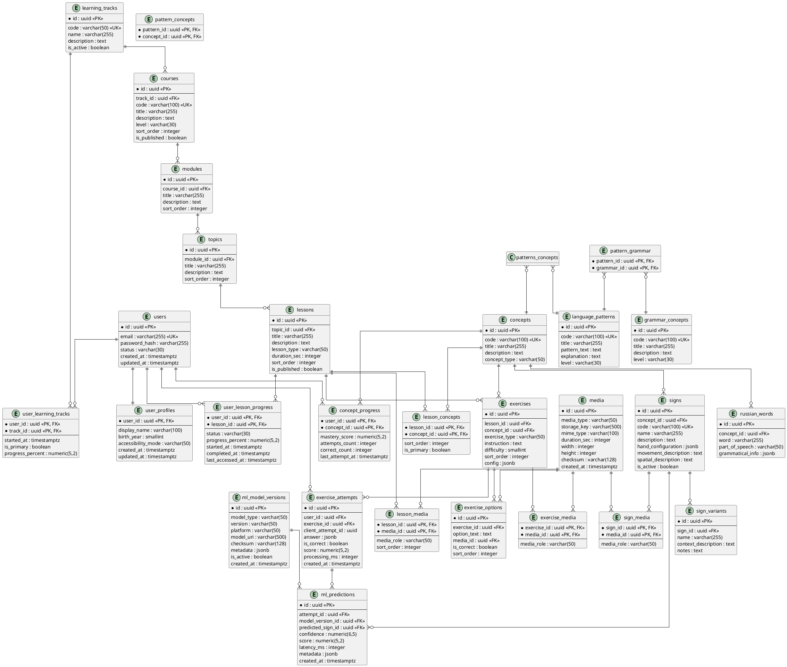

---

# 7. PostgreSQL: основные ENUM

Для MVP рекомендуется использовать PostgreSQL ENUM либо CHECK-ограничения.

Пример:

```sql
CREATE TYPE user_status AS ENUM (
    'ACTIVE',
    'BLOCKED',
    'DELETED'
);

CREATE TYPE learning_track_code AS ENUM (
    'HEARING_RSL',
    'DEAF_RSL_RUSSIAN'
);

CREATE TYPE lesson_status AS ENUM (
    'NOT_STARTED',
    'IN_PROGRESS',
    'COMPLETED'
);

CREATE TYPE exercise_type AS ENUM (
    'WATCH_SIGN',
    'SELECT_MEANING',
    'SELECT_SIGN',
    'MATCH',
    'ORDER_WORDS',
    'SHOW_SIGN',
    'SHOW_PHRASE'
);

CREATE TYPE ml_model_type AS ENUM (
    'SIGN_CLASSIFIER',
    'SIGN_PERFORMANCE',
    'SEQUENCE_RECOGNIZER'
);
```

---

# 8. Ключевые ограничения БД

## 8.1. Пользователь

```sql
UNIQUE(users.email)
```

Email должен храниться в нормализованном виде.

---

## 8.2. Основная образовательная траектория

Для одного пользователя допускается только одна основная траектория:

```sql
CREATE UNIQUE INDEX ux_user_primary_track
ON user_learning_tracks(user_id)
WHERE is_primary = true;
```

---

## 8.3. Прогресс

```sql
CHECK (
    progress_percent >= 0
    AND progress_percent <= 100
)
```

---

## 8.4. ML confidence

```sql
CHECK (
    confidence >= 0
    AND confidence <= 1
)
```

---

# 9. Индексы

Минимальный набор:

```sql
CREATE INDEX ix_courses_track
ON courses(track_id);

CREATE INDEX ix_modules_course
ON modules(course_id);

CREATE INDEX ix_topics_module
ON topics(module_id);

CREATE INDEX ix_lessons_topic
ON lessons(topic_id);

CREATE INDEX ix_exercises_lesson
ON exercises(lesson_id);

CREATE INDEX ix_exercise_attempts_user
ON exercise_attempts(user_id, created_at DESC);

CREATE INDEX ix_concept_progress_user
ON concept_progress(user_id);

CREATE INDEX ix_ml_predictions_attempt
ON ml_predictions(attempt_id);

CREATE INDEX ix_signs_concept
ON signs(concept_id);
```

---

# 10. Use Case Diagram

## 10.1. Общая диаграмма

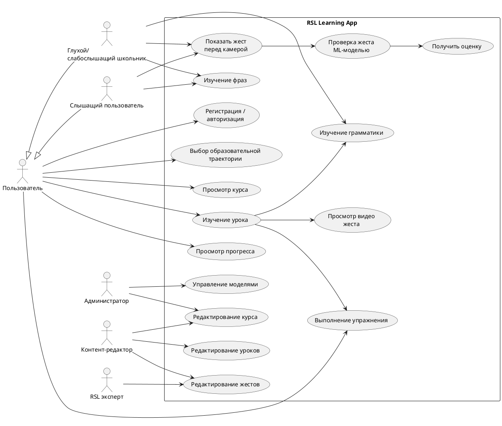

---

# 11. Use Case: прохождение урока

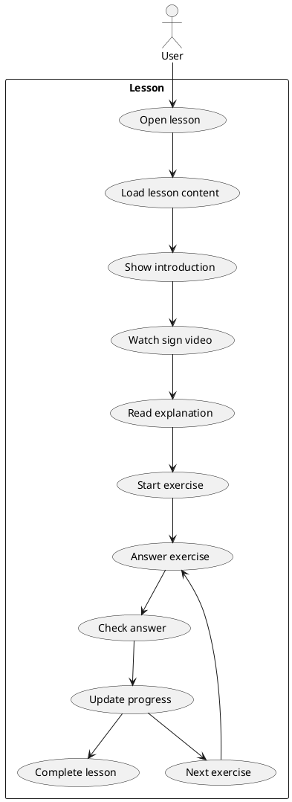

---

# 12. Sequence: авторизация

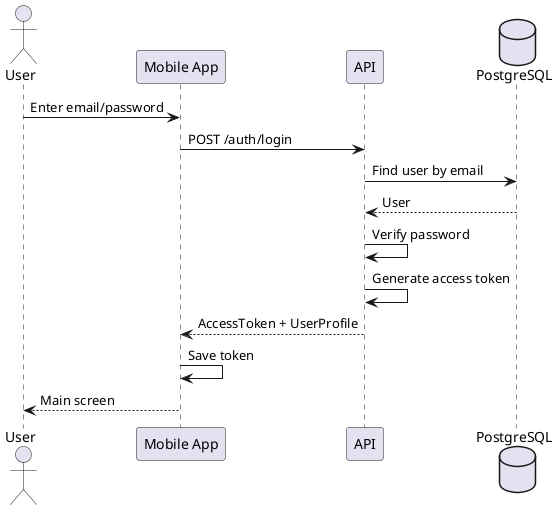

---

# 13. Sequence: получение курса

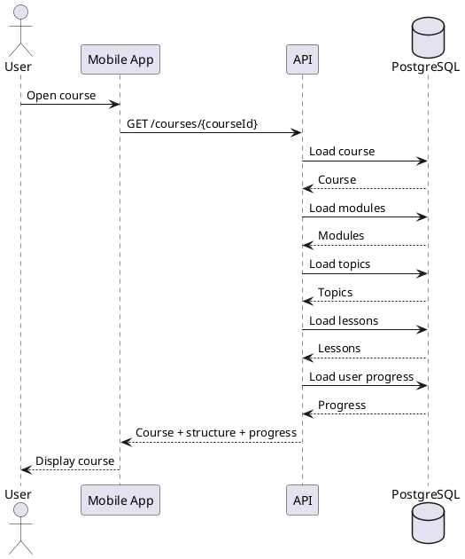

---

# 14. Sequence: выполнение обычного упражнения

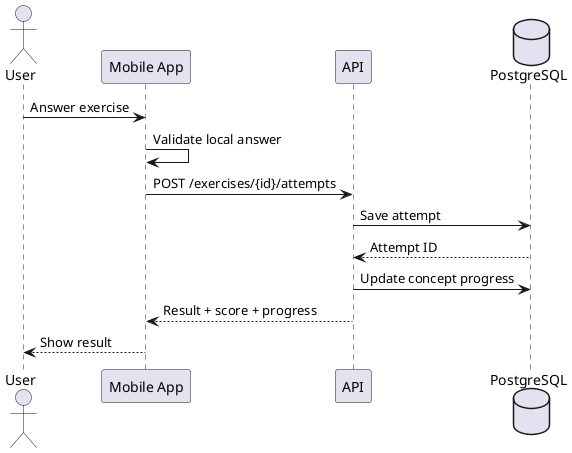

---

# 15. Sequence: проверка жеста камерой

Для MVP основной ML-контур должен работать непосредственно на устройстве.

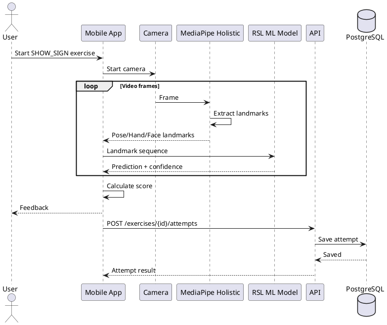

---

# 16. Sequence: offline ML

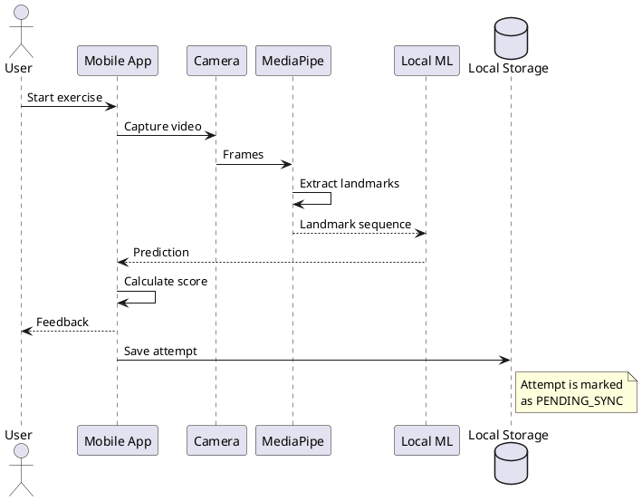

---

# 17. Sequence: синхронизация offline-попыток

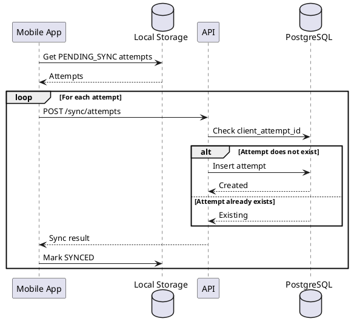

---

# 18. Sequence: обновление ML-модели

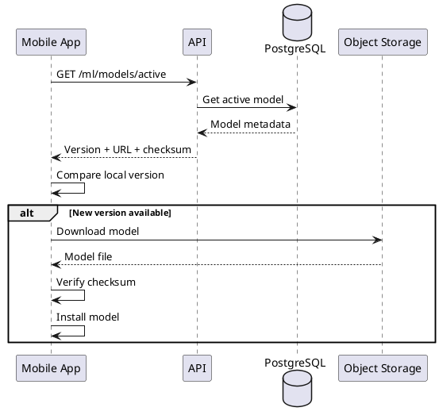

---

# 19. Компонентная диаграмма

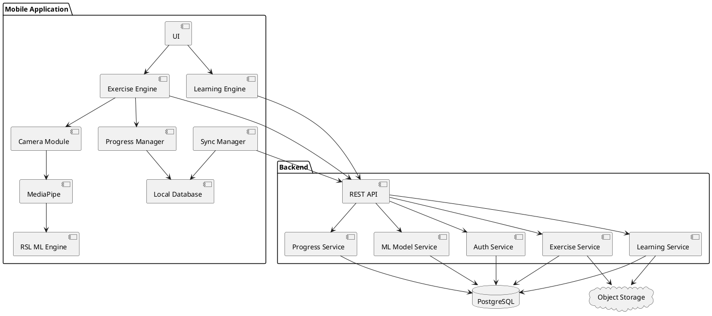

---

# 20. REST API

Base URL:

```text
/api/v1
```

---

# 21. Auth API

## POST /auth/register

Регистрация.

Request:

```json
{
  "email": "user@example.com",
  "password": "string",
  "displayName": "Иван"
}
```

Response:

```json
{
  "user": {
    "id": "uuid",
    "email": "user@example.com",
    "displayName": "Иван"
  },
  "accessToken": "jwt"
}
```

---

## POST /auth/login

Request:

```json
{
  "email": "user@example.com",
  "password": "string"
}
```

Response:

```json
{
  "accessToken": "jwt",
  "tokenType": "Bearer",
  "expiresIn": 3600
}
```

---

# 22. Profile API

## GET /profile

```json
{
  "id": "uuid",
  "displayName": "Иван",
  "track": {
    "code": "HEARING_RSL",
    "name": "Изучение РЖЯ"
  }
}
```

---

## PUT /profile

```json
{
  "displayName": "Иван",
  "accessibilityMode": "VISUAL"
}
```

---

# 23. Learning Track API

## GET /tracks

Response:

```json
[
  {
    "id": "uuid",
    "code": "HEARING_RSL",
    "name": "РЖЯ для слышащих",
    "description": "Изучение русского жестового языка"
  },
  {
    "id": "uuid",
    "code": "DEAF_RSL_RUSSIAN",
    "name": "РЖЯ + русский язык",
    "description": "Изучение РЖЯ и русского языка"
  }
]
```

---

## POST /profile/track

Request:

```json
{
  "trackId": "uuid"
}
```

---

# 24. Courses API

## GET /courses

Query:

```text
GET /courses?trackId={uuid}
```

Response:

```json
[
  {
    "id": "uuid",
    "title": "Основы РЖЯ",
    "level": "BEGINNER",
    "progressPercent": 35.5
  }
]
```

---

## GET /courses/{courseId}

Response:

```json
{
  "id": "uuid",
  "title": "Основы РЖЯ",
  "description": "Первый курс",
  "modules": [
    {
      "id": "uuid",
      "title": "Что такое РЖЯ",
      "sortOrder": 1,
      "topics": [
        {
          "id": "uuid",
          "title": "История РЖЯ",
          "lessons": [
            {
              "id": "uuid",
              "title": "РЖЯ как язык",
              "status": "COMPLETED",
              "progressPercent": 100
            }
          ]
        }
      ]
    }
  ]
}
```

---

# 25. Lessons API

## GET /lessons/{lessonId}

Response:

```json
{
  "id": "uuid",
  "title": "Базовые жесты",
  "description": "Первые жесты РЖЯ",
  "durationSec": 600,

  "concepts": [
    {
      "id": "uuid",
      "title": "Приветствие"
    }
  ],

  "media": [
    {
      "id": "uuid",
      "type": "VIDEO",
      "url": "https://storage.example/video.mp4"
    }
  ],

  "exercises": [
    {
      "id": "uuid",
      "type": "SELECT_MEANING",
      "instruction": "Что означает этот жест?"
    },
    {
      "id": "uuid",
      "type": "SHOW_SIGN",
      "instruction": "Покажите жест «Привет»"
    }
  ]
}
```

---

# 26. Exercises API

## GET /exercises/{exerciseId}

Response:

```json
{
  "id": "uuid",
  "type": "SELECT_MEANING",
  "instruction": "Что означает этот жест?",
  "media": {
    "id": "uuid",
    "type": "VIDEO",
    "url": "https://storage.example/sign.mp4"
  },
  "options": [
    {
      "id": "uuid",
      "text": "Привет"
    },
    {
      "id": "uuid",
      "text": "Спасибо"
    }
  ]
}
```

---

# 27. Exercise Attempt API

## POST /exercises/{exerciseId}/attempts

Для обычного упражнения:

```json
{
  "clientAttemptId": "uuid",
  "answer": {
    "optionId": "uuid"
  }
}
```

Response:

```json
{
  "attemptId": "uuid",
  "isCorrect": true,
  "score": 100,
  "feedback": {
    "type": "SUCCESS",
    "message": "Правильно!"
  }
}
```

---

# 28. SHOW_SIGN API

Для упражнения, в котором пользователь показывает жест, серверу необязательно передавать видео.

Основной MVP-контракт:

```json
{
  "clientAttemptId": "uuid",

  "answer": {
    "type": "LANDMARK_SEQUENCE",
    "frames": 48,
    "durationMs": 2100,

    "prediction": {
      "signId": "uuid",
      "confidence": 0.94
    },

    "score": 92
  },

  "device": {
    "platform": "android",
    "model": "Pixel",
    "appVersion": "1.0.0"
  },

  "ml": {
    "modelVersion": "rsl-signs-0.1.0",
    "processingMs": 87
  }
}
```

Видео по умолчанию не передаётся.

---

# 29. ML Prediction API

Этот endpoint может использоваться для серверной ML-валидации и тестирования моделей.

## POST /ml/predict

Request:

```json
{
  "modelVersion": "rsl-signs-0.1.0",

  "sequence": {
    "frames": 48,
    "features": 543,
    "data": [
      [0.1, 0.2, 0.3]
    ]
  }
}
```

В production фактический размер массива определяется используемым feature schema.

Response:

```json
{
  "prediction": {
    "signId": "uuid",
    "confidence": 0.94
  },

  "alternatives": [
    {
      "signId": "uuid",
      "confidence": 0.94
    },
    {
      "signId": "uuid",
      "confidence": 0.04
    }
  ],

  "processingMs": 85
}
```

---

# 30. Progress API

## GET /progress

Response:

```json
{
  "overallPercent": 42.5,

  "courses": [
    {
      "courseId": "uuid",
      "progressPercent": 67.0
    }
  ],

  "concepts": {
    "total": 120,
    "mastered": 53,
    "learning": 31,
    "new": 36
  }
}
```

---

# 31. Sync API

## POST /sync/attempts

Предназначен для offline-режима.

Request:

```json
{
  "attempts": [
    {
      "clientAttemptId": "uuid",
      "exerciseId": "uuid",
      "answer": {},
      "score": 95,
      "createdAt": "2026-09-11T10:30:00Z"
    }
  ]
}
```

Response:

```json
{
  "results": [
    {
      "clientAttemptId": "uuid",
      "status": "SYNCED",
      "attemptId": "uuid"
    }
  ]
}
```

---

# 32. ML Models API

## GET /ml/models/active

Response:

```json
{
  "models": [
    {
      "id": "uuid",
      "type": "SIGN_CLASSIFIER",
      "version": "0.1.0",
      "platform": "ANDROID",
      "downloadUrl": "https://storage.example/model.tflite",
      "sha256": "..."
    }
  ]
}
```

---

# 33. OpenAPI 3.1

Ниже приведён базовый production-oriented контракт MVP.

```yaml
openapi: 3.1.0

info:
  title: RSL Learning API
  version: 1.0.0
  description: |
    REST API мобильного приложения для изучения
    русского жестового языка.

servers:
  - url: https://api.example.com/api/v1

security:
  - bearerAuth: []

tags:
  - name: Auth
  - name: Profile
  - name: Tracks
  - name: Courses
  - name: Lessons
  - name: Exercises
  - name: Progress
  - name: ML
  - name: Sync

paths:

  /auth/register:
    post:
      tags:
        - Auth
      security: []
      summary: Register user
      requestBody:
        required: true
        content:
          application/json:
            schema:
              $ref: '#/components/schemas/RegisterRequest'
      responses:
        '201':
          description: User registered
          content:
            application/json:
              schema:
                $ref: '#/components/schemas/AuthResponse'
        '409':
          $ref: '#/components/responses/Conflict'

  /auth/login:
    post:
      tags:
        - Auth
      security: []
      summary: Login
      requestBody:
        required: true
        content:
          application/json:
            schema:
              $ref: '#/components/schemas/LoginRequest'
      responses:
        '200':
          description: Login successful
          content:
            application/json:
              schema:
                $ref: '#/components/schemas/AuthResponse'
        '401':
          $ref: '#/components/responses/Unauthorized'

  /profile:
    get:
      tags:
        - Profile
      summary: Get current profile
      responses:
        '200':
          description: Profile
          content:
            application/json:
              schema:
                $ref: '#/components/schemas/UserProfile'

    put:
      tags:
        - Profile
      summary: Update profile
      requestBody:
        required: true
        content:
          application/json:
            schema:
              $ref: '#/components/schemas/ProfileUpdateRequest'
      responses:
        '200':
          description: Updated profile
          content:
            application/json:
              schema:
                $ref: '#/components/schemas/UserProfile'

  /tracks:
    get:
      tags:
        - Tracks
      summary: Get learning tracks
      responses:
        '200':
          description: Learning tracks
          content:
            application/json:
              schema:
                type: array
                items:
                  $ref: '#/components/schemas/LearningTrack'

  /profile/track:
    post:
      tags:
        - Tracks
      summary: Select learning track
      requestBody:
        required: true
        content:
          application/json:
            schema:
              $ref: '#/components/schemas/SelectTrackRequest'
      responses:
        '200':
          description: Track selected

  /courses:
    get:
      tags:
        - Courses
      summary: Get courses
      parameters:
        - name: trackId
          in: query
          required: true
          schema:
            type: string
            format: uuid
      responses:
        '200':
          description: Courses
          content:
            application/json:
              schema:
                type: array
                items:
                  $ref: '#/components/schemas/CourseSummary'

  /courses/{courseId}:
    get:
      tags:
        - Courses
      summary: Get course
      parameters:
        - $ref: '#/components/parameters/CourseId'
      responses:
        '200':
          description: Course
          content:
            application/json:
              schema:
                $ref: '#/components/schemas/Course'

  /lessons/{lessonId}:
    get:
      tags:
        - Lessons
      summary: Get lesson
      parameters:
        - $ref: '#/components/parameters/LessonId'
      responses:
        '200':
          description: Lesson
          content:
            application/json:
              schema:
                $ref: '#/components/schemas/Lesson'

  /exercises/{exerciseId}:
    get:
      tags:
        - Exercises
      summary: Get exercise
      parameters:
        - $ref: '#/components/parameters/ExerciseId'
      responses:
        '200':
          description: Exercise
          content:
            application/json:
              schema:
                $ref: '#/components/schemas/Exercise'

  /exercises/{exerciseId}/attempts:
    post:
      tags:
        - Exercises
      summary: Submit exercise attempt
      parameters:
        - $ref: '#/components/parameters/ExerciseId'
      requestBody:
        required: true
        content:
          application/json:
            schema:
              $ref: '#/components/schemas/AttemptRequest'
      responses:
        '201':
          description: Attempt created
          content:
            application/json:
              schema:
                $ref: '#/components/schemas/AttemptResponse'

  /progress:
    get:
      tags:
        - Progress
      summary: Get user progress
      responses:
        '200':
          description: Progress
          content:
            application/json:
              schema:
                $ref: '#/components/schemas/UserProgress'

  /sync/attempts:
    post:
      tags:
        - Sync
      summary: Synchronize offline attempts
      requestBody:
        required: true
        content:
          application/json:
            schema:
              $ref: '#/components/schemas/SyncAttemptsRequest'
      responses:
        '200':
          description: Synchronization result
          content:
            application/json:
              schema:
                $ref: '#/components/schemas/SyncAttemptsResponse'

  /ml/models/active:
    get:
      tags:
        - ML
      summary: Get active ML models
      responses:
        '200':
          description: ML models
          content:
            application/json:
              schema:
                $ref: '#/components/schemas/MLModelsResponse'

  /ml/predict:
    post:
      tags:
        - ML
      summary: Predict sign from landmark sequence
      requestBody:
        required: true
        content:
          application/json:
            schema:
              $ref: '#/components/schemas/MLPredictionRequest'
      responses:
        '200':
          description: Prediction
          content:
            application/json:
              schema:
                $ref: '#/components/schemas/MLPredictionResponse'

components:

  securitySchemes:

    bearerAuth:
      type: http
      scheme: bearer
      bearerFormat: JWT

  parameters:

    CourseId:
      name: courseId
      in: path
      required: true
      schema:
        type: string
        format: uuid

    LessonId:
      name: lessonId
      in: path
      required: true
      schema:
        type: string
        format: uuid

    ExerciseId:
      name: exerciseId
      in: path
      required: true
      schema:
        type: string
        format: uuid

  responses:

    Unauthorized:
      description: Unauthorized

    Conflict:
      description: Resource already exists

  schemas:

    RegisterRequest:
      type: object
      required:
        - email
        - password
      properties:
        email:
          type: string
          format: email
        password:
          type: string
          minLength: 8
        displayName:
          type: string
          maxLength: 100

    LoginRequest:
      type: object
      required:
        - email
        - password
      properties:
        email:
          type: string
          format: email
        password:
          type: string

    AuthResponse:
      type: object
      required:
        - accessToken
        - tokenType
      properties:
        accessToken:
          type: string
        tokenType:
          type: string
          example: Bearer
        expiresIn:
          type: integer
          example: 3600
        user:
          $ref: '#/components/schemas/User'

    User:
      type: object
      required:
        - id
        - email
      properties:
        id:
          type: string
          format: uuid
        email:
          type: string
          format: email
        displayName:
          type: string

    UserProfile:
      type: object
      properties:
        id:
          type: string
          format: uuid
        displayName:
          type: string
        accessibilityMode:
          type: string
        track:
          $ref: '#/components/schemas/LearningTrack'

    ProfileUpdateRequest:
      type: object
      properties:
        displayName:
          type: string
        accessibilityMode:
          type: string

    LearningTrack:
      type: object
      required:
        - id
        - code
        - name
      properties:
        id:
          type: string
          format: uuid
        code:
          type: string
          enum:
            - HEARING_RSL
            - DEAF_RSL_RUSSIAN
        name:
          type: string
        description:
          type: string

    SelectTrackRequest:
      type: object
      required:
        - trackId
      properties:
        trackId:
          type: string
          format: uuid

    CourseSummary:
      type: object
      properties:
        id:
          type: string
          format: uuid
        title:
          type: string
        level:
          type: string
        progressPercent:
          type: number
          minimum: 0
          maximum: 100

    Course:
      allOf:
        - $ref: '#/components/schemas/CourseSummary'
        - type: object
          properties:
            description:
              type: string
            modules:
              type: array
              items:
                $ref: '#/components/schemas/Module'

    Module:
      type: object
      properties:
        id:
          type: string
          format: uuid
        title:
          type: string
        sortOrder:
          type: integer
        topics:
          type: array
          items:
            $ref: '#/components/schemas/Topic'

    Topic:
      type: object
      properties:
        id:
          type: string
          format: uuid
        title:
          type: string
        sortOrder:
          type: integer
        lessons:
          type: array
          items:
            $ref: '#/components/schemas/LessonSummary'

    LessonSummary:
      type: object
      properties:
        id:
          type: string
          format: uuid
        title:
          type: string
        status:
          type: string
          enum:
            - NOT_STARTED
            - IN_PROGRESS
            - COMPLETED
        progressPercent:
          type: number
          minimum: 0
          maximum: 100

    Lesson:
      type: object
      properties:
        id:
          type: string
          format: uuid
        title:
          type: string
        description:
          type: string
        durationSec:
          type: integer
        concepts:
          type: array
          items:
            $ref: '#/components/schemas/Concept'
        media:
          type: array
          items:
            $ref: '#/components/schemas/Media'
        exercises:
          type: array
          items:
            $ref: '#/components/schemas/ExerciseSummary'

    Concept:
      type: object
      properties:
        id:
          type: string
          format: uuid
        code:
          type: string
        title:
          type: string
        description:
          type: string

    Media:
      type: object
      properties:
        id:
          type: string
          format: uuid
        type:
          type: string
          enum:
            - VIDEO
            - IMAGE
            - AUDIO
        url:
          type: string
          format: uri
        durationSec:
          type: integer

    ExerciseSummary:
      type: object
      properties:
        id:
          type: string
          format: uuid
        type:
          type: string
        instruction:
          type: string

    Exercise:
      allOf:
        - $ref: '#/components/schemas/ExerciseSummary'
        - type: object
          properties:
            difficulty:
              type: integer
              minimum: 1
              maximum: 5
            media:
              type: array
              items:
                $ref: '#/components/schemas/Media'
            options:
              type: array
              items:
                $ref: '#/components/schemas/ExerciseOption'

    ExerciseOption:
      type: object
      properties:
        id:
          type: string
          format: uuid
        text:
          type: string
        media:
          $ref: '#/components/schemas/Media'

    AttemptRequest:
      type: object
      required:
        - clientAttemptId
        - answer
      properties:
        clientAttemptId:
          type: string
          format: uuid
        answer:
          type: object
          additionalProperties: true
        score:
          type: number
          minimum: 0
          maximum: 100
        ml:
          $ref: '#/components/schemas/MLResult'

    AttemptResponse:
      type: object
      properties:
        attemptId:
          type: string
          format: uuid
        isCorrect:
          type: boolean
        score:
          type: number
        feedback:
          type: string

    MLResult:
      type: object
      properties:
        modelVersion:
          type: string
        predictedSignId:
          type: string
          format: uuid
        confidence:
          type: number
          minimum: 0
          maximum: 1
        processingMs:
          type: integer

    UserProgress:
      type: object
      properties:
        overallPercent:
          type: number
        courses:
          type: array
          items:
            type: object
            properties:
              courseId:
                type: string
                format: uuid
              progressPercent:
                type: number
        concepts:
          type: object
          properties:
            total:
              type: integer
            mastered:
              type: integer
            learning:
              type: integer
            new:
              type: integer

    SyncAttemptsRequest:
      type: object
      required:
        - attempts
      properties:
        attempts:
          type: array
          items:
            $ref: '#/components/schemas/OfflineAttempt'

    OfflineAttempt:
      type: object
      required:
        - clientAttemptId
        - exerciseId
        - createdAt
      properties:
        clientAttemptId:
          type: string
          format: uuid
        exerciseId:
          type: string
          format: uuid
        answer:
          type: object
          additionalProperties: true
        score:
          type: number
        createdAt:
          type: string
          format: date-time

    SyncAttemptsResponse:
      type: object
      properties:
        results:
          type: array
          items:
            type: object
            properties:
              clientAttemptId:
                type: string
                format: uuid
              status:
                type: string
                enum:
                  - SYNCED
                  - ALREADY_EXISTS
                  - FAILED
              attemptId:
                type: string
                format: uuid

    MLPredictionRequest:
      type: object
      required:
        - modelVersion
        - sequence
      properties:
        modelVersion:
          type: string
        sequence:
          $ref: '#/components/schemas/LandmarkSequence'

    LandmarkSequence:
      type: object
      required:
        - frames
        - features
        - data
      properties:
        frames:
          type: integer
        features:
          type: integer
        data:
          type: array
          items:
            type: array
            items:
              type: number

    MLPredictionResponse:
      type: object
      properties:
        prediction:
          type: object
          properties:
            signId:
              type: string
              format: uuid
            confidence:
              type: number
        alternatives:
          type: array
          items:
            type: object
            properties:
              signId:
                type: string
                format: uuid
              confidence:
                type: number
        processingMs:
          type: integer

    MLModelsResponse:
      type: object
      properties:
        models:
          type: array
          items:
            type: object
            properties:
              id:
                type: string
                format: uuid
              type:
                type: string
              version:
                type: string
              platform:
                type: string
              downloadUrl:
                type: string
                format: uri
              sha256:
                type: string
```

---

# 34. Контракт LandmarkSequence

## 34.1. Общая структура

ML-модель не должна получать непосредственно RGB-видео в MVP.

Pipeline:

```text
Camera
   ↓
Video Frame
   ↓
MediaPipe Holistic
   ↓
Landmarks
   ↓
Normalization
   ↓
Temporal Window
   ↓
RSL ML Model
```

---

# 35. Feature vector

В качестве первоначального варианта:

```text
Pose landmarks
Hand landmarks
Face landmarks
```

Формат:

```text
[T, N, F]
```

где:

- `T` — количество кадров;
    
- `N` — количество landmarks;
    
- `F` — количество признаков одного landmark.
    

Например:

```text
x
y
z
visibility
```

Фактический набор признаков должен быть зафиксирован в `model metadata`.

---

# 36. Нормализация

Перед передачей данных модели необходимо устранить зависимость от:

- расстояния пользователя до камеры;
    
- положения пользователя в кадре;
    
- масштаба тела;
    
- частично — положения камеры.
    

Пример:

```text
1. определить reference point;
2. перенести координаты относительно reference;
3. нормализовать масштаб;
4. привести sequence к требуемой длине;
5. применить mask для отсутствующих landmarks.
```

---

# 37. ML Model Metadata

Каждая модель должна иметь metadata:

```json
{
  "modelType": "SIGN_CLASSIFIER",
  "version": "0.1.0",

  "input": {
    "shape": [64, 543, 4],
    "normalization": "body_center_scale"
  },

  "output": {
    "type": "classification",
    "classes": 100
  },

  "training": {
    "datasetVersion": "rsl-001"
  },

  "metrics": {
    "top1": 0.91,
    "top5": 0.98,
    "macroF1": 0.89
  }
}
```

---

# 38. Логика оценки выполнения жеста

Важно разделить:

```text
Prediction
```

и

```text
Performance evaluation
```

Например:

Пользователь показал жест.

Модель определила:

```text
"Привет" — confidence 0.94
```

Это означает:

> модель считает наиболее вероятным классом «Привет».

Но это ещё не обязательно означает:

> жест выполнен идеально.

В MVP можно использовать упрощённую модель:

```text
score = confidence × 100
```

Но архитектура должна позволять перейти к более сложной оценке:

```text
Performance Model
 ├── trajectory similarity
 ├── hand configuration
 ├── movement
 ├── spatial position
 ├── timing
 └── facial/body features
```

---

# 39. Идемпотентность API

Для offline-сценариев каждый attempt должен иметь:

```text
clientAttemptId : UUID
```

Например:

```json
{
  "clientAttemptId": "4a8a0f20-..."
}
```

На сервере:

```sql
UNIQUE(user_id, client_attempt_id)
```

Это предотвращает дублирование попыток при повторной отправке.

---

# 40. Версионирование API

Использовать:

```text
/api/v1
```

При несовместимых изменениях:

```text
/api/v2
```

Не рекомендуется менять смысл существующих полей внутри `/v1`.

---

# 41. HTTP-коды

Основные:

```text
200 OK
201 Created
204 No Content

400 Bad Request
401 Unauthorized
403 Forbidden
404 Not Found
409 Conflict
422 Unprocessable Entity
429 Too Many Requests

500 Internal Server Error
```

---

# 42. Формат ошибки

Все ошибки должны иметь единый формат:

```json
{
  "error": {
    "code": "LESSON_NOT_FOUND",
    "message": "Lesson not found",
    "details": {}
  }
}
```

Примеры:

```text
AUTH_INVALID_CREDENTIALS
USER_NOT_FOUND
TRACK_NOT_FOUND
COURSE_NOT_FOUND
LESSON_NOT_FOUND
EXERCISE_NOT_FOUND
INVALID_ATTEMPT
ML_MODEL_NOT_FOUND
SYNC_CONFLICT
```

---

# 43. Аутентификация

Для MVP:

```text
JWT Bearer
```

Header:

```http
Authorization: Bearer <token>
```

Access token:

```text
15–60 min
```

Refresh token:

```text
несколько дней/недель
```

Refresh token рекомендуется хранить отдельно и отзывать при logout.

---

# 44. Авторизация

MVP:

```text
USER
ADMIN
```

Следующая версия:

```text
TEACHER
CONTENT_EDITOR
RSL_EXPERT
ML_REVIEWER
PARENT
```

---

# 45. Безопасность видео

Принцип:

> Видео пользователя не является обязательным объектом хранения.

Обычный сценарий:

```text
Camera
 ↓
MediaPipe
 ↓
Landmarks
 ↓
ML
 ↓
Score
 ↓
Result
```

Видео удаляется после обработки.

Сервер получает:

```text
prediction
confidence
score
modelVersion
latency
device metadata
```

а не видеозапись.

Хранение видео допускается только для специально предусмотренного сценария:

```text
explicit user consent
+
research/debug mode
```

---

# 46. CMS

Для реального MVP желательно предусмотреть административный интерфейс.

Минимальные операции:

```text
Course
 ├── create
 ├── edit
 ├── publish
 └── archive

Lesson
 ├── create
 ├── edit
 ├── reorder
 └── publish

Concept
 ├── create
 └── edit

Sign
 ├── create
 ├── add video
 ├── add variant
 └── edit

Exercise
 ├── create
 ├── edit
 └── publish
```

---

# 47. Статус контента

Для образовательного контента:

```text
DRAFT
IN_REVIEW
APPROVED
PUBLISHED
ARCHIVED
```

Для жестов рекомендуется обязательное подтверждение RSL-экспертом перед публикацией.

---

# 48. Контентная модель жеста

Рекомендуемая структура:

```text
Sign
 ├── Concept
 ├── Sign Variant
 ├── Video
 ├── Description
 ├── Hand Configuration
 ├── Movement
 ├── Location
 ├── Orientation
 ├── Non-manual markers
 └── Context
```

Особенно важен последний пункт.

РЖЯ нельзя качественно описать только координатами рук.

---

# 49. Non-manual features

Для дальнейшего ML следует предусмотреть:

```text
facial expression
eyebrows
mouth
head movement
body posture
gaze
```

Поэтому MediaPipe Holistic предпочтительнее модели, использующей только руки.

---

# 50. MVP ML scope

В MVP НЕ реализуется:

```text
свободный перевод РЖЯ → русский текст
```

Реализуется:

```text
ограниченный словарь
        ↓
isolated sign recognition
        ↓
оценка выполнения
```

Например:

```text
100–200 жестов
```

---

# 51. V2 ML

Добавляется:

```text
sequence recognition
```

Например:

```text
Я
+
дом
+
идти
```

Модель должна учитывать временную последовательность.

---

# 52. V3 ML

Полноценная архитектура:

```text
RSL video
    ↓
Landmarks
    ↓
Temporal encoder
    ↓
Sign/semantic representation
    ↓
Language model
    ↓
Russian text
```

То есть:

```text
РЖЯ → смысл → русский текст
```

а не:

```text
каждый жест → отдельное русское слово
```

---

# 53. Acceptance Criteria MVP

## AC-01

Пользователь может зарегистрироваться.

## AC-02

Пользователь может выбрать:

```text
РЖЯ
```

или

```text
РЖЯ + русский язык
```

## AC-03

Пользователь видит курс, модули, темы и уроки.

## AC-04

Пользователь может открыть урок и просмотреть видео.

## AC-05

Пользователь может выполнять упражнения.

## AC-06

Результат упражнения сохраняется.

## AC-07

Прогресс пользователя рассчитывается автоматически.

## AC-08

Пользователь может выполнить упражнение `SHOW_SIGN`.

## AC-09

Камера распознаёт landmarks.

## AC-10

ML-модель возвращает Top-1 prediction и confidence.

## AC-11

Пользователь получает визуальную обратную связь.

## AC-12

Попытка сохраняется offline.

## AC-13

После восстановления сети попытка синхронизируется.

## AC-14

Повторная синхронизация не создаёт дубль.

## AC-15

ML-модель имеет версию.

## AC-16

Приложение может определить наличие новой версии модели.

---

# 54. MVP Definition of Done

MVP считается технически готовым, если:

```text
[ ] PostgreSQL schema deployed
[ ] migrations implemented
[ ] REST API implemented
[ ] JWT authentication implemented
[ ] course structure implemented
[ ] lesson content implemented
[ ] exercise engine implemented
[ ] progress implemented
[ ] offline storage implemented
[ ] sync implemented
[ ] camera module implemented
[ ] MediaPipe integrated
[ ] baseline RSL model integrated
[ ] ML model versioning implemented
[ ] basic analytics implemented
[ ] privacy policy implemented
[ ] crash/error logging implemented
[ ] Android build available
[ ] iOS build available
```

---

# 55. Рекомендуемый порядок разработки

## Sprint 1 — Foundation

```text
PostgreSQL
Backend
Auth
User
Profile
LearningTrack
```

## Sprint 2 — Learning

```text
Course
Module
Topic
Lesson
Concept
Media
```

## Sprint 3 — Exercises

```text
Exercise
ExerciseOption
Attempt
Progress
```

## Sprint 4 — Mobile ML

```text
Camera
MediaPipe
Landmarks
Baseline classifier
```

## Sprint 5 — ML integration

```text
SHOW_SIGN
prediction
confidence
score
offline ML
```

## Sprint 6 — Synchronization

```text
offline attempts
sync
idempotency
model update
```

## Sprint 7 — Content + QA

```text
100–200 signs
lessons
exercises
RSL expert validation
UX testing
```

---

# 56. Критическая зависимость проекта

Самый большой технический риск MVP — не PostgreSQL, REST или Flutter.

Главный риск:

```text
достаточно ли качественно ML сможет
распознавать РЖЯ по landmarks
на реальных пользователях?
```

Поэтому ML spike необходимо выполнить **до полноценной разработки приложения**.

Минимальный эксперимент:

```text
100 signs
×
10–20 signers
×
несколько repetitions
```

Сравнить:

```text
Hands only
vs
Hands + Pose
vs
Hands + Pose + Face
```

и:

```text
LSTM
vs
Transformer
```

---

# 57. Метрики ML Spike

Обязательно измерять:

```text
Top-1 accuracy
Top-5 accuracy
Macro F1
Confusion matrix
Signer-independent accuracy
Latency
Model size
RAM usage
```

Ключевая метрика:

> signer-independent accuracy

То есть пользователь, которого модель никогда не видела при обучении, должен быть способен выполнить жест.

---

# 58. Архитектурное решение MVP

Итоговая архитектура:

```text
                     ┌─────────────────┐
                     │   RSL Content   │
                     └────────┬────────┘
                              │
                              ▼
┌──────────────┐      ┌──────────────┐
│ Mobile       │ HTTPS│   Backend    │
│              ├─────►│              │
│ Flutter      │      │ FastAPI      │
│              │      │ PostgreSQL   │
│ Camera       │      └──────┬───────┘
│ MediaPipe    │             │
│ Local ML     │             ▼
│ Offline DB   │      ┌──────────────┐
└──────┬───────┘      │ Object       │
       │              │ Storage      │
       │              └──────────────┘
       │
       ▼
┌──────────────────┐
│ RSL ML Engine    │
│                  │
│ Landmarks        │
│      ↓           │
│ Temporal Model   │
│      ↓           │
│ Sign Classifier  │
└──────────────────┘
```

---

# 59. Главное архитектурное решение

Приложение следует проектировать не как:

```text
словарь жестов
```

и не как:

```text
переводчик РЖЯ
```

а как:

```text
ЯЗЫКОВАЯ ОБУЧАЮЩАЯ ПЛАТФОРМА
        +
ВИЗУАЛЬНЫЙ RSL-КОНТЕНТ
        +
ML-ПРОВЕРКА ПРАКТИКИ
```

Это позволяет постепенно двигаться:

```text
MVP
│
├── 100–200 жестов
├── базовая грамматика
├── фразы
├── упражнения
└── isolated sign recognition
        │
        ▼
V2
│
├── sequence recognition
├── sentence exercises
├── adaptive learning
└── grammar-aware scoring
        │
        ▼
V3
│
├── RSL → Russian
├── свободные диалоги
└── полноценный SL2T
```

---

# 60. Итоговый набор технических артефактов

После данного этапа для команды сформирован следующий набор:

```text
1. Product/educational model
2. PostgreSQL ER model
3. PlantUML ER diagram
4. Use Case diagrams
5. Sequence diagrams
6. Component architecture
7. REST API structure
8. OpenAPI 3.1 contract
9. ML LandmarkSequence contract
10. Offline synchronization protocol
11. ML model versioning
12. MVP acceptance criteria
13. Definition of Done
14. Sprint decomposition
```

Следующим техническим этапом рекомендуется превратить эту модель непосредственно в **PostgreSQL DDL + полный PlantUML-комплект + готовый `openapi.yaml`**, чтобы их можно было сразу положить в Git-репозиторий проекта и использовать как основу разработки.

Я бы следующим шагом сделал именно **физическую модель БД**: полный `CREATE TABLE` для PostgreSQL с UUID, FK, `ENUM`, `CHECK`, индексами, `ON DELETE`, audit-полями и seed-данными для первых двух траекторий. Это уже будет практически готовая миграция для backend-разработчика.

---

# 4 MVP физическая модель БД

Ниже — полноценная физическая модель PostgreSQL для MVP, согласованная с ранее спроектированной ER-моделью и OpenAPI. Я заложил UUID, PostgreSQL ENUM, FK с явным `ON DELETE`, audit-поля, ограничения целостности, индексы и seed для двух траекторий: `HEARING_RSL` и `DEAF_RSL_RUSSIAN`.
```sql
-- ============================================================
-- RSL Learning MVP
-- PostgreSQL Physical Database Model
-- Version: 1.0
-- ============================================================

BEGIN;

-- ============================================================
-- 0. EXTENSIONS
-- ============================================================

CREATE EXTENSION IF NOT EXISTS pgcrypto;


-- ============================================================
-- 1. ENUM TYPES
-- ============================================================

CREATE TYPE user_status AS ENUM (
    'ACTIVE',
    'BLOCKED',
    'DELETED'
);

CREATE TYPE accessibility_mode AS ENUM (
    'DEFAULT',
    'VISUAL',
    'HIGH_CONTRAST'
);

CREATE TYPE learning_track_code AS ENUM (
    'HEARING_RSL',
    'DEAF_RSL_RUSSIAN'
);

CREATE TYPE lesson_status AS ENUM (
    'NOT_STARTED',
    'IN_PROGRESS',
    'COMPLETED'
);

CREATE TYPE lesson_type AS ENUM (
    'THEORY',
    'PRACTICE',
    'DIALOG',
    'MIXED'
);

CREATE TYPE concept_type AS ENUM (
    'WORD',
    'PHRASE',
    'GRAMMAR',
    'GENERAL'
);

CREATE TYPE media_type AS ENUM (
    'VIDEO',
    'IMAGE',
    'AUDIO'
);

CREATE TYPE exercise_type AS ENUM (
    'WATCH_SIGN',
    'SELECT_MEANING',
    'SELECT_SIGN',
    'MATCH',
    'ORDER_WORDS',
    'SHOW_SIGN',
    'SHOW_PHRASE'
);

CREATE TYPE exercise_feedback_type AS ENUM (
    'SUCCESS',
    'TRY_AGAIN',
    'PARTIAL',
    'INFORMATION'
);

CREATE TYPE ml_model_type AS ENUM (
    'SIGN_CLASSIFIER',
    'SIGN_PERFORMANCE',
    'SEQUENCE_RECOGNIZER'
);

CREATE TYPE ml_platform AS ENUM (
    'ANDROID',
    'IOS',
    'SERVER',
    'UNIVERSAL'
);

CREATE TYPE attempt_sync_status AS ENUM (
    'PENDING',
    'SYNCED',
    'FAILED'
);


-- ============================================================
-- 2. COMMON AUDIT TRIGGER
-- ============================================================

CREATE OR REPLACE FUNCTION set_updated_at()
RETURNS TRIGGER
LANGUAGE plpgsql
AS $$
BEGIN
    NEW.updated_at = CURRENT_TIMESTAMP;
    RETURN NEW;
END;
$$;


-- ============================================================
-- 3. USERS
-- ============================================================

CREATE TABLE users (
    id UUID PRIMARY KEY DEFAULT gen_random_uuid(),

    email VARCHAR(255) NOT NULL,
    password_hash TEXT NOT NULL,

    status user_status NOT NULL DEFAULT 'ACTIVE',

    created_at TIMESTAMPTZ NOT NULL DEFAULT CURRENT_TIMESTAMP,
    updated_at TIMESTAMPTZ NOT NULL DEFAULT CURRENT_TIMESTAMP,
    deleted_at TIMESTAMPTZ,

    CONSTRAINT uq_users_email
        UNIQUE (email),

    CONSTRAINT chk_users_email_not_empty
        CHECK (length(trim(email)) > 0),

    CONSTRAINT chk_users_deleted_status
        CHECK (
            (status = 'DELETED' AND deleted_at IS NOT NULL)
            OR
            (status <> 'DELETED')
        )
);

CREATE INDEX idx_users_status
    ON users(status);

CREATE INDEX idx_users_created_at
    ON users(created_at);

CREATE TRIGGER trg_users_updated_at
BEFORE UPDATE ON users
FOR EACH ROW
EXECUTE FUNCTION set_updated_at();


-- ============================================================
-- 4. USER PROFILES
-- ============================================================

CREATE TABLE user_profiles (
    id UUID PRIMARY KEY DEFAULT gen_random_uuid(),

    user_id UUID NOT NULL,

    display_name VARCHAR(100),
    birth_year SMALLINT,

    accessibility_mode accessibility_mode NOT NULL DEFAULT 'DEFAULT',

    created_at TIMESTAMPTZ NOT NULL DEFAULT CURRENT_TIMESTAMP,
    updated_at TIMESTAMPTZ NOT NULL DEFAULT CURRENT_TIMESTAMP,

    CONSTRAINT fk_user_profiles_user
        FOREIGN KEY (user_id)
        REFERENCES users(id)
        ON DELETE CASCADE,

    CONSTRAINT uq_user_profiles_user
        UNIQUE (user_id),

    CONSTRAINT chk_user_profiles_display_name
        CHECK (
            display_name IS NULL
            OR length(trim(display_name)) > 0
        ),

    CONSTRAINT chk_user_profiles_birth_year
        CHECK (
            birth_year IS NULL
            OR birth_year BETWEEN 1900 AND 2100
        )
);

CREATE INDEX idx_user_profiles_user_id
    ON user_profiles(user_id);

CREATE TRIGGER trg_user_profiles_updated_at
BEFORE UPDATE ON user_profiles
FOR EACH ROW
EXECUTE FUNCTION set_updated_at();


-- ============================================================
-- 5. LEARNING TRACKS
-- ============================================================

CREATE TABLE learning_tracks (
    id UUID PRIMARY KEY DEFAULT gen_random_uuid(),

    code learning_track_code NOT NULL,
    name VARCHAR(255) NOT NULL,
    description TEXT,

    is_active BOOLEAN NOT NULL DEFAULT TRUE,

    created_at TIMESTAMPTZ NOT NULL DEFAULT CURRENT_TIMESTAMP,
    updated_at TIMESTAMPTZ NOT NULL DEFAULT CURRENT_TIMESTAMP,

    CONSTRAINT uq_learning_tracks_code
        UNIQUE (code),

    CONSTRAINT chk_learning_tracks_name
        CHECK (length(trim(name)) > 0)
);

CREATE INDEX idx_learning_tracks_active
    ON learning_tracks(is_active);

CREATE TRIGGER trg_learning_tracks_updated_at
BEFORE UPDATE ON learning_tracks
FOR EACH ROW
EXECUTE FUNCTION set_updated_at();


-- ============================================================
-- 6. USER ↔ LEARNING TRACK
-- ============================================================

CREATE TABLE user_learning_tracks (
    user_id UUID NOT NULL,
    track_id UUID NOT NULL,

    is_current BOOLEAN NOT NULL DEFAULT TRUE,

    started_at TIMESTAMPTZ NOT NULL DEFAULT CURRENT_TIMESTAMP,
    completed_at TIMESTAMPTZ,

    created_at TIMESTAMPTZ NOT NULL DEFAULT CURRENT_TIMESTAMP,
    updated_at TIMESTAMPTZ NOT NULL DEFAULT CURRENT_TIMESTAMP,

    PRIMARY KEY (user_id, track_id),

    CONSTRAINT fk_user_learning_tracks_user
        FOREIGN KEY (user_id)
        REFERENCES users(id)
        ON DELETE CASCADE,

    CONSTRAINT fk_user_learning_tracks_track
        FOREIGN KEY (track_id)
        REFERENCES learning_tracks(id)
        ON DELETE RESTRICT,

    CONSTRAINT chk_user_learning_tracks_dates
        CHECK (
            completed_at IS NULL
            OR completed_at >= started_at
        )
);

CREATE INDEX idx_user_learning_tracks_track
    ON user_learning_tracks(track_id);

CREATE INDEX idx_user_learning_tracks_current
    ON user_learning_tracks(user_id, is_current);

CREATE UNIQUE INDEX uq_user_learning_tracks_current
    ON user_learning_tracks(user_id)
    WHERE is_current = TRUE;

CREATE TRIGGER trg_user_learning_tracks_updated_at
BEFORE UPDATE ON user_learning_tracks
FOR EACH ROW
EXECUTE FUNCTION set_updated_at();


-- ============================================================
-- 7. COURSES
-- ============================================================

CREATE TABLE courses (
    id UUID PRIMARY KEY DEFAULT gen_random_uuid(),

    track_id UUID NOT NULL,

    code VARCHAR(100) NOT NULL,
    title VARCHAR(255) NOT NULL,
    description TEXT,

    level VARCHAR(30) NOT NULL,

    is_published BOOLEAN NOT NULL DEFAULT FALSE,

    created_at TIMESTAMPTZ NOT NULL DEFAULT CURRENT_TIMESTAMP,
    updated_at TIMESTAMPTZ NOT NULL DEFAULT CURRENT_TIMESTAMP,

    CONSTRAINT fk_courses_track
        FOREIGN KEY (track_id)
        REFERENCES learning_tracks(id)
        ON DELETE RESTRICT,

    CONSTRAINT uq_courses_track_code
        UNIQUE (track_id, code),

    CONSTRAINT chk_courses_title
        CHECK (length(trim(title)) > 0),

    CONSTRAINT chk_courses_level
        CHECK (
            level IN (
                'BEGINNER',
                'ELEMENTARY',
                'INTERMEDIATE',
                'ADVANCED'
            )
        )
);

CREATE INDEX idx_courses_track
    ON courses(track_id);

CREATE INDEX idx_courses_published
    ON courses(is_published);

CREATE TRIGGER trg_courses_updated_at
BEFORE UPDATE ON courses
FOR EACH ROW
EXECUTE FUNCTION set_updated_at();


-- ============================================================
-- 8. MODULES
-- ============================================================

CREATE TABLE modules (
    id UUID PRIMARY KEY DEFAULT gen_random_uuid(),

    course_id UUID NOT NULL,

    title VARCHAR(255) NOT NULL,
    description TEXT,

    sort_order INTEGER NOT NULL,

    created_at TIMESTAMPTZ NOT NULL DEFAULT CURRENT_TIMESTAMP,
    updated_at TIMESTAMPTZ NOT NULL DEFAULT CURRENT_TIMESTAMP,

    CONSTRAINT fk_modules_course
        FOREIGN KEY (course_id)
        REFERENCES courses(id)
        ON DELETE CASCADE,

    CONSTRAINT chk_modules_sort_order
        CHECK (sort_order >= 0),

    CONSTRAINT uq_modules_course_sort_order
        UNIQUE (course_id, sort_order)
);

CREATE INDEX idx_modules_course
    ON modules(course_id);

CREATE TRIGGER trg_modules_updated_at
BEFORE UPDATE ON modules
FOR EACH ROW
EXECUTE FUNCTION set_updated_at();


-- ============================================================
-- 9. TOPICS
-- ============================================================

CREATE TABLE topics (
    id UUID PRIMARY KEY DEFAULT gen_random_uuid(),

    module_id UUID NOT NULL,

    title VARCHAR(255) NOT NULL,
    description TEXT,

    sort_order INTEGER NOT NULL,

    created_at TIMESTAMPTZ NOT NULL DEFAULT CURRENT_TIMESTAMP,
    updated_at TIMESTAMPTZ NOT NULL DEFAULT CURRENT_TIMESTAMP,

    CONSTRAINT fk_topics_module
        FOREIGN KEY (module_id)
        REFERENCES modules(id)
        ON DELETE CASCADE,

    CONSTRAINT chk_topics_sort_order
        CHECK (sort_order >= 0),

    CONSTRAINT uq_topics_module_sort_order
        UNIQUE (module_id, sort_order)
);

CREATE INDEX idx_topics_module
    ON topics(module_id);

CREATE TRIGGER trg_topics_updated_at
BEFORE UPDATE ON topics
FOR EACH ROW
EXECUTE FUNCTION set_updated_at();


-- ============================================================
-- 10. LESSONS
-- ============================================================

CREATE TABLE lessons (
    id UUID PRIMARY KEY DEFAULT gen_random_uuid(),

    topic_id UUID NOT NULL,

    title VARCHAR(255) NOT NULL,
    description TEXT,

    lesson_type lesson_type NOT NULL DEFAULT 'THEORY',

    sort_order INTEGER NOT NULL,

    duration_sec INTEGER,

    created_at TIMESTAMPTZ NOT NULL DEFAULT CURRENT_TIMESTAMP,
    updated_at TIMESTAMPTZ NOT NULL DEFAULT CURRENT_TIMESTAMP,

    CONSTRAINT fk_lessons_topic
        FOREIGN KEY (topic_id)
        REFERENCES topics(id)
        ON DELETE CASCADE,

    CONSTRAINT chk_lessons_sort_order
        CHECK (sort_order >= 0),

    CONSTRAINT chk_lessons_duration
        CHECK (
            duration_sec IS NULL
            OR duration_sec >= 0
        ),

    CONSTRAINT uq_lessons_topic_sort_order
        UNIQUE (topic_id, sort_order)
);

CREATE INDEX idx_lessons_topic
    ON lessons(topic_id);

CREATE TRIGGER trg_lessons_updated_at
BEFORE UPDATE ON lessons
FOR EACH ROW
EXECUTE FUNCTION set_updated_at();


-- ============================================================
-- 11. CONCEPTS
-- ============================================================

CREATE TABLE concepts (
    id UUID PRIMARY KEY DEFAULT gen_random_uuid(),

    code VARCHAR(100) NOT NULL,
    title VARCHAR(255) NOT NULL,
    description TEXT,

    concept_type concept_type NOT NULL DEFAULT 'GENERAL',

    created_at TIMESTAMPTZ NOT NULL DEFAULT CURRENT_TIMESTAMP,
    updated_at TIMESTAMPTZ NOT NULL DEFAULT CURRENT_TIMESTAMP,

    CONSTRAINT uq_concepts_code
        UNIQUE (code),

    CONSTRAINT chk_concepts_code
        CHECK (length(trim(code)) > 0),

    CONSTRAINT chk_concepts_title
        CHECK (length(trim(title)) > 0)
);

CREATE INDEX idx_concepts_type
    ON concepts(concept_type);

CREATE TRIGGER trg_concepts_updated_at
BEFORE UPDATE ON concepts
FOR EACH ROW
EXECUTE FUNCTION set_updated_at();


-- ============================================================
-- 12. LESSON ↔ CONCEPT
-- ============================================================

CREATE TABLE lesson_concepts (
    lesson_id UUID NOT NULL,
    concept_id UUID NOT NULL,

    sort_order INTEGER NOT NULL DEFAULT 0,

    created_at TIMESTAMPTZ NOT NULL DEFAULT CURRENT_TIMESTAMP,

    PRIMARY KEY (lesson_id, concept_id),

    CONSTRAINT fk_lesson_concepts_lesson
        FOREIGN KEY (lesson_id)
        REFERENCES lessons(id)
        ON DELETE CASCADE,

    CONSTRAINT fk_lesson_concepts_concept
        FOREIGN KEY (concept_id)
        REFERENCES concepts(id)
        ON DELETE RESTRICT,

    CONSTRAINT chk_lesson_concepts_sort_order
        CHECK (sort_order >= 0)
);

CREATE INDEX idx_lesson_concepts_concept
    ON lesson_concepts(concept_id);

CREATE INDEX idx_lesson_concepts_order
    ON lesson_concepts(lesson_id, sort_order);


-- ============================================================
-- 13. RUSSIAN WORDS
-- ============================================================

CREATE TABLE russian_words (
    id UUID PRIMARY KEY DEFAULT gen_random_uuid(),

    concept_id UUID NOT NULL,

    word VARCHAR(255) NOT NULL,
    normalized_word VARCHAR(255) NOT NULL,

    part_of_speech VARCHAR(50),

    created_at TIMESTAMPTZ NOT NULL DEFAULT CURRENT_TIMESTAMP,
    updated_at TIMESTAMPTZ NOT NULL DEFAULT CURRENT_TIMESTAMP,

    CONSTRAINT fk_russian_words_concept
        FOREIGN KEY (concept_id)
        REFERENCES concepts(id)
        ON DELETE CASCADE,

    CONSTRAINT chk_russian_words_word
        CHECK (length(trim(word)) > 0)
);

CREATE INDEX idx_russian_words_concept
    ON russian_words(concept_id);

CREATE INDEX idx_russian_words_normalized
    ON russian_words(normalized_word);

CREATE TRIGGER trg_russian_words_updated_at
BEFORE UPDATE ON russian_words
FOR EACH ROW
EXECUTE FUNCTION set_updated_at();


-- ============================================================
-- 14. SIGNS
-- ============================================================

CREATE TABLE signs (
    id UUID PRIMARY KEY DEFAULT gen_random_uuid(),

    concept_id UUID NOT NULL,

    code VARCHAR(100) NOT NULL,
    name VARCHAR(255) NOT NULL,

    description TEXT,

    is_active BOOLEAN NOT NULL DEFAULT TRUE,

    created_at TIMESTAMPTZ NOT NULL DEFAULT CURRENT_TIMESTAMP,
    updated_at TIMESTAMPTZ NOT NULL DEFAULT CURRENT_TIMESTAMP,

    CONSTRAINT fk_signs_concept
        FOREIGN KEY (concept_id)
        REFERENCES concepts(id)
        ON DELETE CASCADE,

    CONSTRAINT uq_signs_code
        UNIQUE (code),

    CONSTRAINT chk_signs_code
        CHECK (length(trim(code)) > 0),

    CONSTRAINT chk_signs_name
        CHECK (length(trim(name)) > 0)
);

CREATE INDEX idx_signs_concept
    ON signs(concept_id);

CREATE INDEX idx_signs_active
    ON signs(is_active);

CREATE TRIGGER trg_signs_updated_at
BEFORE UPDATE ON signs
FOR EACH ROW
EXECUTE FUNCTION set_updated_at();


-- ============================================================
-- 15. SIGN VARIANTS
-- ============================================================

CREATE TABLE sign_variants (
    id UUID PRIMARY KEY DEFAULT gen_random_uuid(),

    sign_id UUID NOT NULL,

    variant_code VARCHAR(100) NOT NULL,
    description TEXT,

    created_at TIMESTAMPTZ NOT NULL DEFAULT CURRENT_TIMESTAMP,
    updated_at TIMESTAMPTZ NOT NULL DEFAULT CURRENT_TIMESTAMP,

    CONSTRAINT fk_sign_variants_sign
        FOREIGN KEY (sign_id)
        REFERENCES signs(id)
        ON DELETE CASCADE,

    CONSTRAINT uq_sign_variants_code
        UNIQUE (sign_id, variant_code)
);

CREATE INDEX idx_sign_variants_sign
    ON sign_variants(sign_id);

CREATE TRIGGER trg_sign_variants_updated_at
BEFORE UPDATE ON sign_variants
FOR EACH ROW
EXECUTE FUNCTION set_updated_at();


-- ============================================================
-- 16. GRAMMAR CONCEPTS
-- ============================================================

CREATE TABLE grammar_concepts (
    id UUID PRIMARY KEY DEFAULT gen_random_uuid(),

    concept_id UUID NOT NULL,

    name VARCHAR(255) NOT NULL,
    description TEXT,

    created_at TIMESTAMPTZ NOT NULL DEFAULT CURRENT_TIMESTAMP,
    updated_at TIMESTAMPTZ NOT NULL DEFAULT CURRENT_TIMESTAMP,

    CONSTRAINT fk_grammar_concepts_concept
        FOREIGN KEY (concept_id)
        REFERENCES concepts(id)
        ON DELETE CASCADE,

    CONSTRAINT uq_grammar_concepts_concept
        UNIQUE (concept_id),

    CONSTRAINT chk_grammar_concepts_name
        CHECK (length(trim(name)) > 0)
);

CREATE INDEX idx_grammar_concepts_concept
    ON grammar_concepts(concept_id);

CREATE TRIGGER trg_grammar_concepts_updated_at
BEFORE UPDATE ON grammar_concepts
FOR EACH ROW
EXECUTE FUNCTION set_updated_at();


-- ============================================================
-- 17. LANGUAGE PATTERNS
-- ============================================================

CREATE TABLE language_patterns (
    id UUID PRIMARY KEY DEFAULT gen_random_uuid(),

    code VARCHAR(100) NOT NULL,
    name VARCHAR(255) NOT NULL,

    rsl_description TEXT,
    russian_description TEXT,

    example_rsl TEXT,
    example_russian TEXT,

    created_at TIMESTAMPTZ NOT NULL DEFAULT CURRENT_TIMESTAMP,
    updated_at TIMESTAMPTZ NOT NULL DEFAULT CURRENT_TIMESTAMP,

    CONSTRAINT uq_language_patterns_code
        UNIQUE (code),

    CONSTRAINT chk_language_patterns_code
        CHECK (length(trim(code)) > 0)
);

CREATE INDEX idx_language_patterns_code
    ON language_patterns(code);

CREATE TRIGGER trg_language_patterns_updated_at
BEFORE UPDATE ON language_patterns
FOR EACH ROW
EXECUTE FUNCTION set_updated_at();


-- ============================================================
-- 18. PATTERN ↔ CONCEPT
-- ============================================================

CREATE TABLE pattern_concepts (
    pattern_id UUID NOT NULL,
    concept_id UUID NOT NULL,

    sort_order INTEGER NOT NULL DEFAULT 0,

    created_at TIMESTAMPTZ NOT NULL DEFAULT CURRENT_TIMESTAMP,

    PRIMARY KEY (pattern_id, concept_id),

    CONSTRAINT fk_pattern_concepts_pattern
        FOREIGN KEY (pattern_id)
        REFERENCES language_patterns(id)
        ON DELETE CASCADE,

    CONSTRAINT fk_pattern_concepts_concept
        FOREIGN KEY (concept_id)
        REFERENCES concepts(id)
        ON DELETE RESTRICT,

    CONSTRAINT chk_pattern_concepts_sort_order
        CHECK (sort_order >= 0)
);

CREATE INDEX idx_pattern_concepts_concept
    ON pattern_concepts(concept_id);


-- ============================================================
-- 19. PATTERN ↔ GRAMMAR
-- ============================================================

CREATE TABLE pattern_grammar (
    pattern_id UUID NOT NULL,
    grammar_concept_id UUID NOT NULL,

    sort_order INTEGER NOT NULL DEFAULT 0,

    created_at TIMESTAMPTZ NOT NULL DEFAULT CURRENT_TIMESTAMP,

    PRIMARY KEY (pattern_id, grammar_concept_id),

    CONSTRAINT fk_pattern_grammar_pattern
        FOREIGN KEY (pattern_id)
        REFERENCES language_patterns(id)
        ON DELETE CASCADE,

    CONSTRAINT fk_pattern_grammar_grammar
        FOREIGN KEY (grammar_concept_id)
        REFERENCES grammar_concepts(id)
        ON DELETE RESTRICT,

    CONSTRAINT chk_pattern_grammar_sort_order
        CHECK (sort_order >= 0)
);

CREATE INDEX idx_pattern_grammar_grammar
    ON pattern_grammar(grammar_concept_id);


-- ============================================================
-- 20. MEDIA
-- ============================================================

CREATE TABLE media (
    id UUID PRIMARY KEY DEFAULT gen_random_uuid(),

    type media_type NOT NULL,

    url TEXT NOT NULL,
    mime_type VARCHAR(100),

    duration_sec INTEGER,
    width INTEGER,
    height INTEGER,

    alt_text TEXT,

    created_at TIMESTAMPTZ NOT NULL DEFAULT CURRENT_TIMESTAMP,
    updated_at TIMESTAMPTZ NOT NULL DEFAULT CURRENT_TIMESTAMP,

    CONSTRAINT chk_media_url
        CHECK (length(trim(url)) > 0),

    CONSTRAINT chk_media_duration
        CHECK (
            duration_sec IS NULL
            OR duration_sec >= 0
        ),

    CONSTRAINT chk_media_width
        CHECK (
            width IS NULL
            OR width > 0
        ),

    CONSTRAINT chk_media_height
        CHECK (
            height IS NULL
            OR height > 0
        )
);

CREATE INDEX idx_media_type
    ON media(type);

CREATE TRIGGER trg_media_updated_at
BEFORE UPDATE ON media
FOR EACH ROW
EXECUTE FUNCTION set_updated_at();


-- ============================================================
-- 21. SIGN ↔ MEDIA
-- ============================================================

CREATE TABLE sign_media (
    sign_id UUID NOT NULL,
    media_id UUID NOT NULL,

    is_primary BOOLEAN NOT NULL DEFAULT FALSE,
    sort_order INTEGER NOT NULL DEFAULT 0,

    created_at TIMESTAMPTZ NOT NULL DEFAULT CURRENT_TIMESTAMP,

    PRIMARY KEY (sign_id, media_id),

    CONSTRAINT fk_sign_media_sign
        FOREIGN KEY (sign_id)
        REFERENCES signs(id)
        ON DELETE CASCADE,

    CONSTRAINT fk_sign_media_media
        FOREIGN KEY (media_id)
        REFERENCES media(id)
        ON DELETE RESTRICT,

    CONSTRAINT chk_sign_media_sort_order
        CHECK (sort_order >= 0)
);

CREATE INDEX idx_sign_media_media
    ON sign_media(media_id);

CREATE UNIQUE INDEX uq_sign_media_primary
    ON sign_media(sign_id)
    WHERE is_primary = TRUE;


-- ============================================================
-- 22. LESSON ↔ MEDIA
-- ============================================================

CREATE TABLE lesson_media (
    lesson_id UUID NOT NULL,
    media_id UUID NOT NULL,

    sort_order INTEGER NOT NULL DEFAULT 0,

    created_at TIMESTAMPTZ NOT NULL DEFAULT CURRENT_TIMESTAMP,

    PRIMARY KEY (lesson_id, media_id),

    CONSTRAINT fk_lesson_media_lesson
        FOREIGN KEY (lesson_id)
        REFERENCES lessons(id)
        ON DELETE CASCADE,

    CONSTRAINT fk_lesson_media_media
        FOREIGN KEY (media_id)
        REFERENCES media(id)
        ON DELETE RESTRICT,

    CONSTRAINT chk_lesson_media_sort_order
        CHECK (sort_order >= 0)
);

CREATE INDEX idx_lesson_media_media
    ON lesson_media(media_id);

CREATE INDEX idx_lesson_media_order
    ON lesson_media(lesson_id, sort_order);


-- ============================================================
-- 23. EXERCISES
-- ============================================================

CREATE TABLE exercises (
    id UUID PRIMARY KEY DEFAULT gen_random_uuid(),

    lesson_id UUID NOT NULL,
    concept_id UUID,

    type exercise_type NOT NULL,

    instruction TEXT NOT NULL,

    difficulty SMALLINT NOT NULL DEFAULT 1,

    config JSONB NOT NULL DEFAULT '{}'::jsonb,

    sort_order INTEGER NOT NULL DEFAULT 0,

    created_at TIMESTAMPTZ NOT NULL DEFAULT CURRENT_TIMESTAMP,
    updated_at TIMESTAMPTZ NOT NULL DEFAULT CURRENT_TIMESTAMP,

    CONSTRAINT fk_exercises_lesson
        FOREIGN KEY (lesson_id)
        REFERENCES lessons(id)
        ON DELETE CASCADE,

    CONSTRAINT fk_exercises_concept
        FOREIGN KEY (concept_id)
        REFERENCES concepts(id)
        ON DELETE SET NULL,

    CONSTRAINT chk_exercises_instruction
        CHECK (length(trim(instruction)) > 0),

    CONSTRAINT chk_exercises_difficulty
        CHECK (difficulty BETWEEN 1 AND 5),

    CONSTRAINT chk_exercises_sort_order
        CHECK (sort_order >= 0),

    CONSTRAINT chk_exercises_config_object
        CHECK (jsonb_typeof(config) = 'object')
);

CREATE INDEX idx_exercises_lesson
    ON exercises(lesson_id);

CREATE INDEX idx_exercises_concept
    ON exercises(concept_id);

CREATE INDEX idx_exercises_type
    ON exercises(type);

CREATE INDEX idx_exercises_lesson_order
    ON exercises(lesson_id, sort_order);

CREATE TRIGGER trg_exercises_updated_at
BEFORE UPDATE ON exercises
FOR EACH ROW
EXECUTE FUNCTION set_updated_at();


-- ============================================================
-- 24. EXERCISE OPTIONS
-- ============================================================

CREATE TABLE exercise_options (
    id UUID PRIMARY KEY DEFAULT gen_random_uuid(),

    exercise_id UUID NOT NULL,

    text TEXT,

    is_correct BOOLEAN NOT NULL DEFAULT FALSE,

    sort_order INTEGER NOT NULL DEFAULT 0,

    created_at TIMESTAMPTZ NOT NULL DEFAULT CURRENT_TIMESTAMP,
    updated_at TIMESTAMPTZ NOT NULL DEFAULT CURRENT_TIMESTAMP,

    CONSTRAINT fk_exercise_options_exercise
        FOREIGN KEY (exercise_id)
        REFERENCES exercises(id)
        ON DELETE CASCADE,

    CONSTRAINT chk_exercise_options_content
        CHECK (
            text IS NOT NULL
            AND length(trim(text)) > 0
        ),

    CONSTRAINT chk_exercise_options_sort_order
        CHECK (sort_order >= 0),

    CONSTRAINT uq_exercise_options_order
        UNIQUE (exercise_id, sort_order)
);

CREATE INDEX idx_exercise_options_exercise
    ON exercise_options(exercise_id);

CREATE TRIGGER trg_exercise_options_updated_at
BEFORE UPDATE ON exercise_options
FOR EACH ROW
EXECUTE FUNCTION set_updated_at();


-- ============================================================
-- 25. EXERCISE ↔ MEDIA
-- ============================================================

CREATE TABLE exercise_media (
    exercise_id UUID NOT NULL,
    media_id UUID NOT NULL,

    sort_order INTEGER NOT NULL DEFAULT 0,

    created_at TIMESTAMPTZ NOT NULL DEFAULT CURRENT_TIMESTAMP,

    PRIMARY KEY (exercise_id, media_id),

    CONSTRAINT fk_exercise_media_exercise
        FOREIGN KEY (exercise_id)
        REFERENCES exercises(id)
        ON DELETE CASCADE,

    CONSTRAINT fk_exercise_media_media
        FOREIGN KEY (media_id)
        REFERENCES media(id)
        ON DELETE RESTRICT,

    CONSTRAINT chk_exercise_media_sort_order
        CHECK (sort_order >= 0)
);

CREATE INDEX idx_exercise_media_media
    ON exercise_media(media_id);


-- ============================================================
-- 26. USER LESSON PROGRESS
-- ============================================================

CREATE TABLE user_lesson_progress (
    id UUID PRIMARY KEY DEFAULT gen_random_uuid(),

    user_id UUID NOT NULL,
    lesson_id UUID NOT NULL,

    status lesson_status NOT NULL DEFAULT 'NOT_STARTED',

    progress_percent NUMERIC(5,2) NOT NULL DEFAULT 0,

    started_at TIMESTAMPTZ,
    completed_at TIMESTAMPTZ,

    created_at TIMESTAMPTZ NOT NULL DEFAULT CURRENT_TIMESTAMP,
    updated_at TIMESTAMPTZ NOT NULL DEFAULT CURRENT_TIMESTAMP,

    CONSTRAINT fk_user_lesson_progress_user
        FOREIGN KEY (user_id)
        REFERENCES users(id)
        ON DELETE CASCADE,

    CONSTRAINT fk_user_lesson_progress_lesson
        FOREIGN KEY (lesson_id)
        REFERENCES lessons(id)
        ON DELETE CASCADE,

    CONSTRAINT uq_user_lesson_progress
        UNIQUE (user_id, lesson_id),

    CONSTRAINT chk_user_lesson_progress_percent
        CHECK (progress_percent BETWEEN 0 AND 100),

    CONSTRAINT chk_user_lesson_progress_dates
        CHECK (
            completed_at IS NULL
            OR started_at IS NULL
            OR completed_at >= started_at
        ),

    CONSTRAINT chk_user_lesson_progress_status
        CHECK (
            status <> 'COMPLETED'
            OR progress_percent = 100
        )
);

CREATE INDEX idx_user_lesson_progress_user
    ON user_lesson_progress(user_id);

CREATE INDEX idx_user_lesson_progress_lesson
    ON user_lesson_progress(lesson_id);

CREATE TRIGGER trg_user_lesson_progress_updated_at
BEFORE UPDATE ON user_lesson_progress
FOR EACH ROW
EXECUTE FUNCTION set_updated_at();


-- ============================================================
-- 27. CONCEPT PROGRESS
-- ============================================================

CREATE TABLE concept_progress (
    id UUID PRIMARY KEY DEFAULT gen_random_uuid(),

    user_id UUID NOT NULL,
    concept_id UUID NOT NULL,

    mastery_score NUMERIC(5,2) NOT NULL DEFAULT 0,

    attempts_count INTEGER NOT NULL DEFAULT 0,
    correct_count INTEGER NOT NULL DEFAULT 0,

    last_attempt_at TIMESTAMPTZ,

    created_at TIMESTAMPTZ NOT NULL DEFAULT CURRENT_TIMESTAMP,
    updated_at TIMESTAMPTZ NOT NULL DEFAULT CURRENT_TIMESTAMP,

    CONSTRAINT fk_concept_progress_user
        FOREIGN KEY (user_id)
        REFERENCES users(id)
        ON DELETE CASCADE,

    CONSTRAINT fk_concept_progress_concept
        FOREIGN KEY (concept_id)
        REFERENCES concepts(id)
        ON DELETE CASCADE,

    CONSTRAINT uq_concept_progress
        UNIQUE (user_id, concept_id),

    CONSTRAINT chk_concept_progress_mastery
        CHECK (mastery_score BETWEEN 0 AND 100),

    CONSTRAINT chk_concept_progress_attempts
        CHECK (attempts_count >= 0),

    CONSTRAINT chk_concept_progress_correct
        CHECK (
            correct_count >= 0
            AND correct_count <= attempts_count
        )
);

CREATE INDEX idx_concept_progress_user
    ON concept_progress(user_id);

CREATE INDEX idx_concept_progress_concept
    ON concept_progress(concept_id);

CREATE INDEX idx_concept_progress_mastery
    ON concept_progress(user_id, mastery_score);

CREATE TRIGGER trg_concept_progress_updated_at
BEFORE UPDATE ON concept_progress
FOR EACH ROW
EXECUTE FUNCTION set_updated_at();


-- ============================================================
-- 28. EXERCISE ATTEMPTS
-- ============================================================

CREATE TABLE exercise_attempts (
    id UUID PRIMARY KEY DEFAULT gen_random_uuid(),

    user_id UUID NOT NULL,
    exercise_id UUID NOT NULL,

    client_attempt_id UUID NOT NULL,

    answer JSONB NOT NULL DEFAULT '{}'::jsonb,

    score NUMERIC(5,2),
    is_correct BOOLEAN,

    ml_result JSONB,

    device_info JSONB,

    sync_status attempt_sync_status NOT NULL DEFAULT 'SYNCED',

    attempted_at TIMESTAMPTZ NOT NULL DEFAULT CURRENT_TIMESTAMP,

    created_at TIMESTAMPTZ NOT NULL DEFAULT CURRENT_TIMESTAMP,
    updated_at TIMESTAMPTZ NOT NULL DEFAULT CURRENT_TIMESTAMP,

    CONSTRAINT fk_exercise_attempts_user
        FOREIGN KEY (user_id)
        REFERENCES users(id)
        ON DELETE CASCADE,

    CONSTRAINT fk_exercise_attempts_exercise
        FOREIGN KEY (exercise_id)
        REFERENCES exercises(id)
        ON DELETE RESTRICT,

    CONSTRAINT uq_exercise_attempts_client_id
        UNIQUE (user_id, client_attempt_id),

    CONSTRAINT chk_exercise_attempts_score
        CHECK (
            score IS NULL
            OR score BETWEEN 0 AND 100
        ),

    CONSTRAINT chk_exercise_attempts_answer
        CHECK (jsonb_typeof(answer) = 'object'),

    CONSTRAINT chk_exercise_attempts_ml_result
        CHECK (
            ml_result IS NULL
            OR jsonb_typeof(ml_result) = 'object'
        ),

    CONSTRAINT chk_exercise_attempts_device_info
        CHECK (
            device_info IS NULL
            OR jsonb_typeof(device_info) = 'object'
        )
);

CREATE INDEX idx_exercise_attempts_user
    ON exercise_attempts(user_id);

CREATE INDEX idx_exercise_attempts_exercise
    ON exercise_attempts(exercise_id);

CREATE INDEX idx_exercise_attempts_user_date
    ON exercise_attempts(user_id, attempted_at DESC);

CREATE INDEX idx_exercise_attempts_sync_status
    ON exercise_attempts(sync_status);

CREATE TRIGGER trg_exercise_attempts_updated_at
BEFORE UPDATE ON exercise_attempts
FOR EACH ROW
EXECUTE FUNCTION set_updated_at();


-- ============================================================
-- 29. ML MODEL VERSIONS
-- ============================================================

CREATE TABLE ml_model_versions (
    id UUID PRIMARY KEY DEFAULT gen_random_uuid(),

    model_type ml_model_type NOT NULL,
    version VARCHAR(100) NOT NULL,

    platform ml_platform NOT NULL,

    download_url TEXT,
    sha256 CHAR(64) NOT NULL,

    input_schema_version VARCHAR(50),

    metadata JSONB NOT NULL DEFAULT '{}'::jsonb,

    is_active BOOLEAN NOT NULL DEFAULT FALSE,

    created_at TIMESTAMPTZ NOT NULL DEFAULT CURRENT_TIMESTAMP,
    updated_at TIMESTAMPTZ NOT NULL DEFAULT CURRENT_TIMESTAMP,

    CONSTRAINT uq_ml_model_versions
        UNIQUE (model_type, version, platform),

    CONSTRAINT chk_ml_model_sha256
        CHECK (sha256 ~ '^[0-9a-fA-F]{64}$'),

    CONSTRAINT chk_ml_model_metadata
        CHECK (jsonb_typeof(metadata) = 'object'),

    CONSTRAINT chk_ml_model_download_url
        CHECK (
            download_url IS NULL
            OR length(trim(download_url)) > 0
        )
);

CREATE INDEX idx_ml_model_versions_type
    ON ml_model_versions(model_type);

CREATE INDEX idx_ml_model_versions_platform
    ON ml_model_versions(platform);

CREATE INDEX idx_ml_model_versions_active
    ON ml_model_versions(is_active);

CREATE UNIQUE INDEX uq_ml_model_active
    ON ml_model_versions(model_type, platform)
    WHERE is_active = TRUE;

CREATE TRIGGER trg_ml_model_versions_updated_at
BEFORE UPDATE ON ml_model_versions
FOR EACH ROW
EXECUTE FUNCTION set_updated_at();


-- ============================================================
-- 30. ML PREDICTIONS
-- ============================================================

CREATE TABLE ml_predictions (
    id UUID PRIMARY KEY DEFAULT gen_random_uuid(),

    user_id UUID,

    exercise_attempt_id UUID,

    model_version_id UUID NOT NULL,

    predicted_sign_id UUID,

    confidence NUMERIC(6,5) NOT NULL,

    score NUMERIC(5,2),

    processing_ms INTEGER,

    created_at TIMESTAMPTZ NOT NULL DEFAULT CURRENT_TIMESTAMP,
    updated_at TIMESTAMPTZ NOT NULL DEFAULT CURRENT_TIMESTAMP,

    CONSTRAINT fk_ml_predictions_user
        FOREIGN KEY (user_id)
        REFERENCES users(id)
        ON DELETE SET NULL,

    CONSTRAINT fk_ml_predictions_attempt
        FOREIGN KEY (exercise_attempt_id)
        REFERENCES exercise_attempts(id)
        ON DELETE SET NULL,

    CONSTRAINT fk_ml_predictions_model
        FOREIGN KEY (model_version_id)
        REFERENCES ml_model_versions(id)
        ON DELETE RESTRICT,

    CONSTRAINT fk_ml_predictions_sign
        FOREIGN KEY (predicted_sign_id)
        REFERENCES signs(id)
        ON DELETE SET NULL,

    CONSTRAINT chk_ml_predictions_confidence
        CHECK (confidence BETWEEN 0 AND 1),

    CONSTRAINT chk_ml_predictions_score
        CHECK (
            score IS NULL
            OR score BETWEEN 0 AND 100
        ),

    CONSTRAINT chk_ml_predictions_processing
        CHECK (
            processing_ms IS NULL
            OR processing_ms >= 0
        )
);

CREATE INDEX idx_ml_predictions_user
    ON ml_predictions(user_id);

CREATE INDEX idx_ml_predictions_attempt
    ON ml_predictions(exercise_attempt_id);

CREATE INDEX idx_ml_predictions_model
    ON ml_predictions(model_version_id);

CREATE INDEX idx_ml_predictions_sign
    ON ml_predictions(predicted_sign_id);

CREATE INDEX idx_ml_predictions_created_at
    ON ml_predictions(created_at DESC);

CREATE TRIGGER trg_ml_predictions_updated_at
BEFORE UPDATE ON ml_predictions
FOR EACH ROW
EXECUTE FUNCTION set_updated_at();


-- ============================================================
-- 31. SEED DATA
-- First two educational tracks
-- ============================================================

INSERT INTO learning_tracks (
    id,
    code,
    name,
    description,
    is_active
)
VALUES
(
    '00000000-0000-0000-0000-000000000001',
    'HEARING_RSL',
    'Русский жестовый язык для слышащих',
    'Изучение русского жестового языка как визуального языка: базовые жесты, фразы, грамматика и диалоги.',
    TRUE
),
(
    '00000000-0000-0000-0000-000000000002',
    'DEAF_RSL_RUSSIAN',
    'РЖЯ + русский язык для глухих и слабослышащих школьников',
    'Изучение русского жестового языка и русского языка как отдельной языковой системы через визуальное обучение.',
    TRUE
)
ON CONFLICT (code) DO UPDATE
SET
    name = EXCLUDED.name,
    description = EXCLUDED.description,
    is_active = EXCLUDED.is_active,
    updated_at = CURRENT_TIMESTAMP;


-- ============================================================
-- 32. OPTIONAL BASE COURSE SEED
-- Один стартовый курс для каждой траектории
-- ============================================================

INSERT INTO courses (
    id,
    track_id,
    code,
    title,
    description,
    level,
    is_published
)
VALUES
(
    '10000000-0000-0000-0000-000000000001',
    '00000000-0000-0000-0000-000000000001',
    'RSL-START',
    'РЖЯ с нуля',
    'Введение в русский жестовый язык: история, визуальная природа языка, базовые жесты и простые фразы.',
    'BEGINNER',
    FALSE
),
(
    '10000000-0000-0000-0000-000000000002',
    '00000000-0000-0000-0000-000000000002',
    'RSL-RUS-START',
    'РЖЯ и русский язык с нуля',
    'Введение в РЖЯ и основы русского языка через визуальные объяснения, жесты, слова и простые конструкции.',
    'BEGINNER',
    FALSE
)
ON CONFLICT (track_id, code) DO UPDATE
SET
    title = EXCLUDED.title,
    description = EXCLUDED.description,
    level = EXCLUDED.level,
    updated_at = CURRENT_TIMESTAMP;


-- ============================================================
-- 33. OPTIONAL MODULE SEED
-- ============================================================

INSERT INTO modules (
    id,
    course_id,
    title,
    description,
    sort_order
)
VALUES
(
    '20000000-0000-0000-0000-000000000001',
    '10000000-0000-0000-0000-000000000001',
    'Введение в РЖЯ',
    'Что такое РЖЯ, его особенности и визуальная природа.',
    1
),
(
    '20000000-0000-0000-0000-000000000002',
    '10000000-0000-0000-0000-000000000001',
    'Базовые жесты',
    'Первые повседневные жесты и простые значения.',
    2
),
(
    '20000000-0000-0000-0000-000000000003',
    '10000000-0000-0000-0000-000000000002',
    'РЖЯ как визуальный язык',
    'Основы визуального восприятия и структуры РЖЯ.',
    1
),
(
    '20000000-0000-0000-0000-000000000004',
    '10000000-0000-0000-0000-000000000002',
    'Русский язык через РЖЯ',
    'Связь жестовых понятий и русских слов.',
    2
)
ON CONFLICT (id) DO NOTHING;


-- ============================================================
-- 34. INITIAL CONTENT CONCEPTS
-- ============================================================

INSERT INTO concepts (
    id,
    code,
    title,
    description,
    concept_type
)
VALUES
(
    '30000000-0000-0000-0000-000000000001',
    'CONCEPT_HELLO',
    'Приветствие',
    'Базовое приветствие.',
    'PHRASE'
),
(
    '30000000-0000-0000-0000-000000000002',
    'CONCEPT_THANKS',
    'Спасибо',
    'Базовое выражение благодарности.',
    'WORD'
),
(
    '30000000-0000-0000-0000-000000000003',
    'CONCEPT_YES',
    'Да',
    'Выражение согласия.',
    'WORD'
),
(
    '30000000-0000-0000-0000-000000000004',
    'CONCEPT_NO',
    'Нет',
    'Выражение отрицания.',
    'WORD'
)
ON CONFLICT (code) DO NOTHING;


-- ============================================================
-- 35. RUSSIAN WORDS SEED
-- ============================================================

INSERT INTO russian_words (
    id,
    concept_id,
    word,
    normalized_word
)
VALUES
(
    '40000000-0000-0000-0000-000000000001',
    '30000000-0000-0000-0000-000000000001',
    'привет',
    'привет'
),
(
    '40000000-0000-0000-0000-000000000002',
    '30000000-0000-0000-0000-000000000002',
    'спасибо',
    'спасибо'
),
(
    '40000000-0000-0000-0000-000000000003',
    '30000000-0000-0000-0000-000000000003',
    'да',
    'да'
),
(
    '40000000-0000-0000-0000-000000000004',
    '30000000-0000-0000-0000-000000000004',
    'нет',
    'нет'
)
ON CONFLICT (id) DO NOTHING;


-- ============================================================
-- 36. BASIC SIGN SEED
-- ============================================================

INSERT INTO signs (
    id,
    concept_id,
    code,
    name,
    description
)
VALUES
(
    '50000000-0000-0000-0000-000000000001',
    '30000000-0000-0000-0000-000000000001',
    'RSL_HELLO',
    'Приветствие',
    'Базовый жест приветствия.'
),
(
    '50000000-0000-0000-0000-000000000002',
    '30000000-0000-0000-0000-000000000002',
    'RSL_THANKS',
    'Спасибо',
    'Базовый жест благодарности.'
),
(
    '50000000-0000-0000-0000-000000000003',
    '30000000-0000-0000-0000-000000000003',
    'RSL_YES',
    'Да',
    'Базовый жест согласия.'
),
(
    '50000000-0000-0000-0000-000000000004',
    '30000000-0000-0000-0000-000000000004',
    'RSL_NO',
    'Нет',
    'Базовый жест отрицания.'
)
ON CONFLICT (code) DO NOTHING;


-- ============================================================
-- 37. FINAL COMMENTS
-- ============================================================

COMMENT ON TABLE concepts IS
'Центральная семантическая сущность. Не следует моделировать связь RussianWord -> Sign как 1:1.';

COMMENT ON TABLE signs IS
'Жесты РЖЯ, связанные с концептом. Один концепт может иметь несколько жестов/вариантов.';

COMMENT ON TABLE sign_variants IS
'Варианты исполнения одного жеста.';

COMMENT ON TABLE exercise_attempts IS
'История попыток пользователя. client_attempt_id обеспечивает идемпотентность offline-синхронизации.';

COMMENT ON TABLE ml_predictions IS
'Результаты ML-распознавания. Видео пользователя здесь не хранится.';

COMMENT ON COLUMN exercise_attempts.ml_result IS
'Результат ML: modelVersion, predictedSignId, confidence, score, processingMs и дополнительные поля.';

COMMENT ON COLUMN exercises.config IS
'Типоспецифичная конфигурация упражнения в JSONB.';

COMMENT ON COLUMN ml_model_versions.metadata IS
'Метаданные модели: количество классов, dataset version, preprocessing и прочее.';


COMMIT;
```
